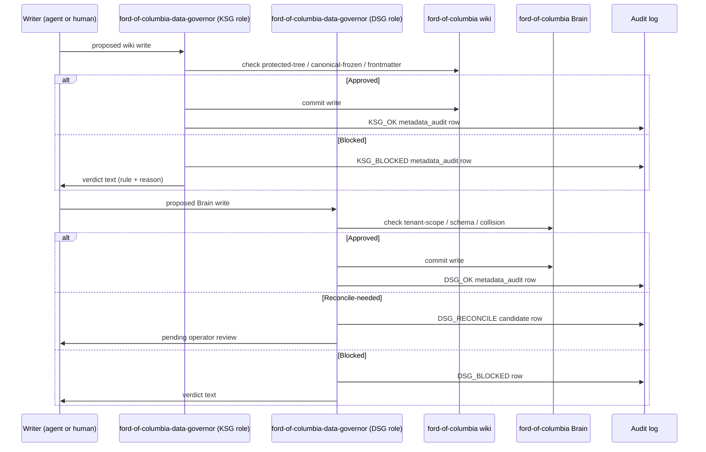

# ford-of-columbia-data-governor

Unified Knowledge Semantic Guardian (KSG) + Data Semantic Guardian (DSG) for the **ford-of-columbia** customer profile. Closes `GAP-SG-001` for ford-of-columbia at the SOUL-identity level.

> **Status: ACTIVE.** Both halves are live for ford-of-columbia: the write-time gate (`src/server/ksg-gate.ts` + `src/server/dsg-gate.ts`) and the read-time cadenced integrity scanner (`src/server/integrity-scanner.ts`, closing `GAP-KSG-SCANNER-001`). This SOUL makes the governor *addressable* for reconciliations and operator queries.

## Sequence (write-time gate)

## Watch paths

- **Wiki (KSG):** `~/.hermes/profiles/ford-of-columbia/{canon,governance,knowledge,archive}/**` (all writes)
- **Brain (DSG):** `~/.hermes/profiles/ford-of-columbia/brain/brain.db` (all writes)
- **Engagement state:** `~/.hermes/profiles/ford-of-columbia/engagement-state.yaml` (read-only; surfaces reconciliation candidates in deployment_notes)

## What it reads at runtime

- Every proposed wiki write to `ford-of-columbia/knowledge/`, `governance/`, `canon/`.
- Every proposed Brain write to `ford-of-columbia/brain/brain.db`.
- Existing canon for collision detection.
- Frontmatter schema (`type`, `status`, `title` required minimum).
- Record-family schemas (16 families per Tranche B).

## What it writes at runtime

- `metadata_audit` rows in `ford-of-columbia/brain/brain.db` for every gated action (sixth invariant).
- Reconciliation candidate rows (DSG) surfaced in `/engagements/ford-of-columbia` deployment notes panel.
- Hunches (DSG) when a write is partially-confident.
- (GAP-KSG-SCANNER-001, shipped) Integrity findings memorialized as `integrity_findings` Brain outputs + surfaced in the engagement deployment-notes panel.

## Recovery branches

- **Blocked write.** Writer receives verdict text + rule id. Writer fixes + retries (KSG re-evaluates).
- **Reconcile-needed.** DSG creates candidate; operator approves OR rejects from `/engagements/ford-of-columbia`. On approval: canon updates + DSG re-evaluates pending writes. On rejection: write rejected, audit row final.
- **Cross-tenant attempt.** A write from a different profile's agent attempting to write here is hard-rejected. Pen-test verified per Tranche F.9.

## Launch-time enforcement scope

At launch this governor enforces:
- Protected-tree denial (canon/, governance/, archive/).
- Canonical-frozen denial (existing `status: canonical` pages).
- Missing-frontmatter denial (required fields per wiki-spec).
- Promote-order (inbox → drafts → published).
- DSG cross-tenant denial.
- DSG schema-conformance.

Cadenced integrity scan (GAP-KSG-SCANNER-001 — shipped in `src/server/integrity-scanner.ts`):
- Broken wikilink scan.
- Drift detection (canon → drafts staleness).
- Dead-end / orphan page detection.
- Conflict detection across pages.
- Cadenced renewal hunches.

## Companion playbook

The full SG playbook lives at `ford-of-columbia-data-governor/governance/semantic-guardian-playbook.md`, distributed from `docs/launch/agent-souls/templates/semantic-guardian-playbook.md` (shipped — closes `GAP-KSG-SCANNER-001`).
