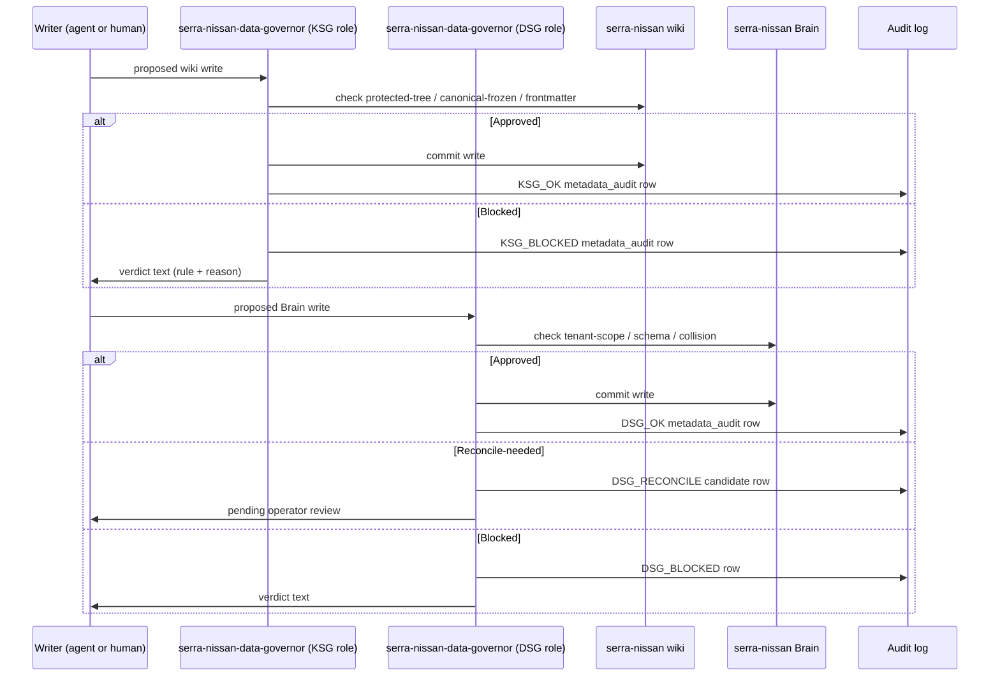

# serra-nissan-data-governor

Unified Knowledge Semantic Guardian (KSG) + Data Semantic Guardian (DSG) for the **serra-nissan** customer profile. Closes `GAP-SG-001` for serra-nissan at the SOUL-identity level.

> **Status: STUB.** Code-level KSG + DSG enforcement is live for serra-nissan via `src/server/ksg-gate.ts` + `src/server/dsg-gate.ts`. This SOUL makes the governor *addressable* for reconciliations, operator queries, and the post-launch integrity scanner (`GAP-KSG-SCANNER-001`).

## Sequence (write-time gate)

## Watch paths

- **Wiki (KSG):** `~/.hermes/profiles/serra-nissan/{canon,governance,knowledge,archive}/**` (all writes)
- **Brain (DSG):** `~/.hermes/profiles/serra-nissan/brain/brain.db` (all writes)
- **Engagement state:** `~/.hermes/profiles/serra-nissan/engagement-state.yaml` (read-only; surfaces reconciliation candidates in deployment_notes)

## What it reads at runtime

- Every proposed wiki write to `serra-nissan/knowledge/`, `governance/`, `canon/`.
- Every proposed Brain write to `serra-nissan/brain/brain.db`.
- Existing canon for collision detection.
- Frontmatter schema (`type`, `status`, `title` required minimum).
- Record-family schemas (16 families per Tranche B).

## What it writes at runtime

- `metadata_audit` rows in `serra-nissan/brain/brain.db` for every gated action (sixth invariant).
- Reconciliation candidate rows (DSG) surfaced in `/engagements/serra-nissan` deployment notes panel.
- Hunches (DSG) when a write is partially-confident.
- (Post-launch, GAP-KSG-SCANNER-001) Integrity findings under `serra-nissan-data-governor/knowledge/findings/`.

## Recovery branches

- **Blocked write.** Writer receives verdict text + rule id. Writer fixes + retries (KSG re-evaluates).
- **Reconcile-needed.** DSG creates candidate; operator approves OR rejects from `/engagements/serra-nissan`. On approval: canon updates + DSG re-evaluates pending writes. On rejection: write rejected, audit row final.
- **Cross-tenant attempt.** A write from a different profile's agent attempting to write here is hard-rejected. Pen-test verified per Tranche F.9.

## Launch-time enforcement scope

At launch this governor enforces:
- Protected-tree denial (canon/, governance/, archive/).
- Canonical-frozen denial (existing `status: canonical` pages).
- Missing-frontmatter denial (required fields per wiki-spec).
- Promote-order (inbox → drafts → published).
- DSG cross-tenant denial.
- DSG schema-conformance.

Post-launch additions (GAP-KSG-SCANNER-001):
- Broken wikilink scan.
- Drift detection (canon → drafts staleness).
- Dead-end / orphan page detection.
- Conflict detection across pages.
- Cadenced renewal hunches.

## Companion playbook

The full SG playbook lives at `serra-nissan-data-governor/governance/semantic-guardian-playbook.md` (not yet written — `GAP-KSG-SCANNER-001` includes this as a deliverable). At launch, this SOUL is the closest substitute.
