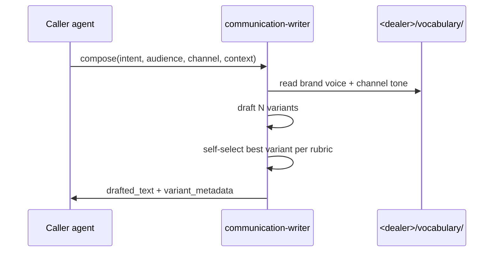

# communication-writer

Pure-compose agent. No direct channel dispatch. Returns drafted text to caller.

## Sequence

## What it reads at runtime

- Per-dealer brand voice at `<dealer>/vocabulary/brand-voice.md`.
- Per-channel tone guidelines at `<dealer>/vocabulary/channel-tones/<channel>.md`.
- Caller-provided context.

## What it writes at runtime

- Nothing persistent. Returns text to caller; caller is responsible for any persistence.

## Recovery branches

- **Compose LLM timeout.** Return error to caller; caller decides whether to retry or fallback.
- **Brand voice missing.** Use default tone; warn in metadata.

## Per-dealer customization

- Brand voice page.
- Per-channel tone pages.
