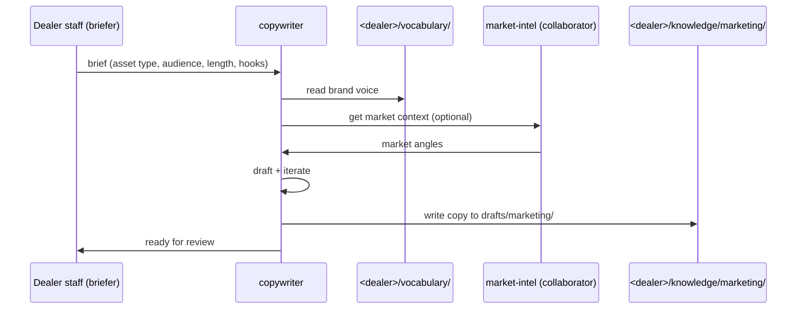

# copywriter

Long-form copy agent. Distinct from communication-writer (which does short transactional messages). Copywriter handles campaigns, web pages, listing descriptions.

## Sequence

## What it reads at runtime

- Brand voice + tone guidelines.
- market-intel SOUL (for collaboration on market-aware copy).
- Vehicle records (for listing descriptions).

## What it writes at runtime

- Draft copy to `<dealer>/knowledge/drafts/marketing/<asset-id>.md` (KSG-gated).

## Recovery branches

- **Brief ambiguous.** Ask clarifying questions; do not draft on guesses.
- **Brand voice missing.** Use neutral tone + warn in draft frontmatter.

## Per-dealer customization

- Brand voice page.
- Approved hooks library per campaign type.
