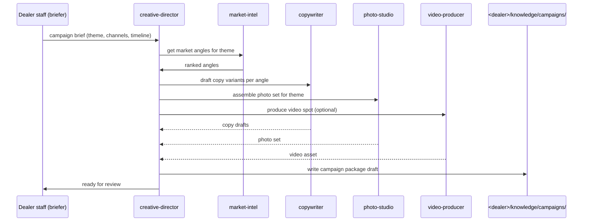

# creative-director

Orchestration agent. Sequences the creative-pipeline agents to produce a campaign package.

## Sequence

## What it reads at runtime

- Campaign brief.
- Per-dealer creative playbook.
- Outputs from each collaborator agent.

## What it writes at runtime

- Campaign package draft at `<dealer>/knowledge/drafts/campaigns/<campaign-id>/`.
- Coordination metadata (which collaborator produced what).

## Recovery branches

- **Collaborator agent fails.** Continue without that asset class; flag in package.
- **All collaborators fail.** Surface to operator; do not attempt to compensate with weaker output.

## Per-dealer customization

- Campaign playbook + theme library.
- Per-channel sequencing rules.

## Status caveat

Depends on collaborator agents (copywriter, photo-studio, video-producer, market-intel) — all of which are templates at launch.
