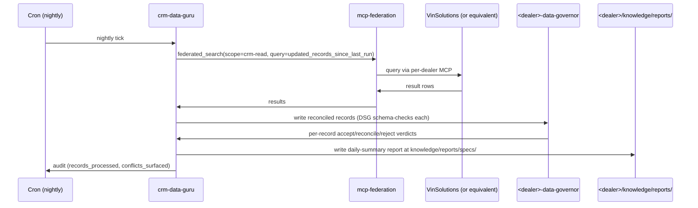

# crm-data-guru

Nightly batch agent that pulls CRM data, reconciles into Brain, surfaces deltas + hunches.

## Sequence

## What it reads at runtime

- Per-dealer mcp.json for CRM federation scope.
- Last-run timestamp from Brain.
- Existing Brain records for conflict detection.

## What it writes at runtime

- Brain records (DSG-gated).
- Daily summary at `<dealer>/knowledge/reports/specs/crm-daily-<date>.md`.
- Reconciliation candidate hunches (when records partially conflict).
- Audit rows.

## Recovery branches

- **CRM unreachable.** Skip the run; alert operator; next nightly tick retries.
- **DSG rejects high % of records.** Halt run; surface to operator for schema review.
- **Cron skipped.** Operator can manually trigger via webhook (when GAP-KSG-SCANNER-001 webhook lands; today: manual dispatch).

## Per-dealer customization

- CRM federation scope.
- Reconciliation conflict thresholds.
- Daily report template.

## Status caveat

VinSolutions MCP is NOT in launch scope per AC.12.3 of Phase C closeout. At launch this agent has no live CRM to query. Template ships for the post-launch CRM integration pass.
