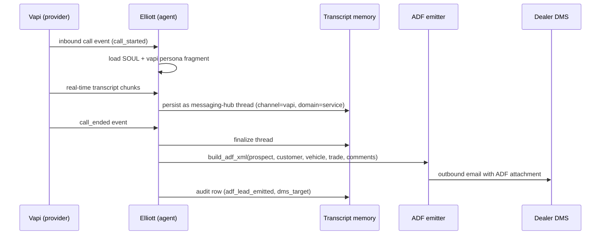

# Elliott — inbound voice service handler

Template for per-dealer instantiation. Live at huminic-motors (CZ-003); copied + customized per dealer when each is enabled.

> **Status: TEMPLATE.** Ships `enabled: false` in every dealer that doesn't have Elliott explicitly turned on. Operator flips per dealer when ready.

## Sequence

## What it reads at runtime

- Own SOUL + `personas/vapi.md` channel persona fragment.
- Workflow page at `<dealer>/knowledge/workflows/elliott-inbound-call.md` (intent ladder, gather order, escalation triggers).
- Vapi assistant config (system prompt + tools) via `<dealer>/mcp.json` vapi server entry.
- Dealer-specific service intent vocabulary at `<dealer>/vocabulary/service-intents.md`.

## What it writes at runtime

- Messaging-hub thread + messages (channel=vapi, domain=service).
- ADF-formatted email outbound to dealer DMS (via Resend MCP or direct SMTP per dealer).
- Audit rows: `call_started`, `call_ended`, `adf_lead_emitted`.
- Brain records: contact + vehicle of interest (if surfaced + DSG approves).

## Recovery branches

- **Vapi 5xx mid-call.** Call drops; transcript persisted to last chunk; thread tagged `partial`. Operator alerted; manual follow-up.
- **ADF send fails.** Retry per Resend retry policy; if persistent fail, surface to operator with parsed lead in audit log.
- **DSG rejects vehicle write.** Vehicle of interest persisted as deployment_note; agent proceeds without Brain write.

## Per-dealer customization

When copying this template to `<dealer>/governance/agents/elliott.md`:
- Update `template_lives_at` to be commented out + add `id: elliott` (no `template:` prefix).
- Add `<dealer>/governance/agents/elliott/personas/vapi.md` with dealer-specific greeting + tone.
- Configure dealer-specific Vapi assistant id in `<dealer>/.env`.
- Update workflow page intent vocab.
- Flip `enabled: true`.
