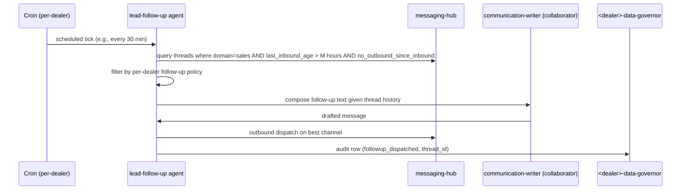

# lead-follow-up

Template for per-dealer instantiation. Cron-triggered scan of stalled leads; composes nudges.

## Sequence

## What it reads at runtime

- Own SOUL + workflow page (`lead-follow-up.md`).
- Stalled thread list from messaging-hub.
- Per-dealer follow-up sequence config (e.g., 24h SMS, 72h email, 7d give-up).
- communication-writer SOUL for composition collaboration.

## What it writes at runtime

- Outbound messages on the chosen channel.
- Thread `last_followup_at` metadata.
- Audit rows.

## Recovery branches

- **Adapter failure.** Per-channel retry policy. If persistent fail on chosen channel, escalate to alternate channel or mark stalled.
- **All follow-ups exhausted.** Mark thread `closed_lost` with reason; surface in weekly report.

## Per-dealer customization

- Schedule cadence per `<dealer>/cron/lead-follow-up.yaml`.
- Follow-up sequence rules per `<dealer>/knowledge/workflows/lead-follow-up.md`.
- Flip `enabled: true` when sequence is decided + adapter credentials live.
