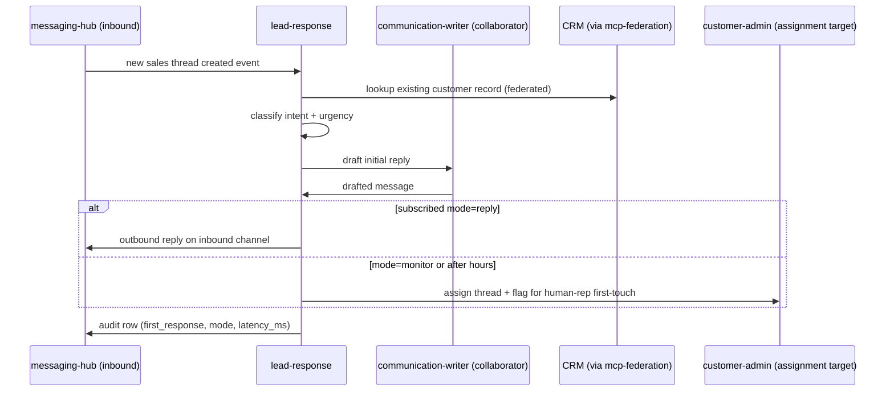

# lead-response

First-response agent for inbound leads (web form, ADF email, SMS, chat widget). Sets the SLA-meeting initial reply + assigns the thread.

## Sequence

## What it reads at runtime

- Inbound thread + first message body + originating channel.
- CRM customer record (if matched via federation).
- Per-dealer intent classification rubric at `<dealer>/knowledge/workflows/lead-first-response.md`.
- communication-writer SOUL for compose collaboration.

## What it writes at runtime

- Outbound reply (if subscribed reply mode).
- Thread assignment metadata (if monitor mode).
- Brain contact + lead record (DSG-gated).
- Audit row with SLA latency.

## Recovery branches

- **CRM federation fails.** Proceed with no-prior-record assumption; flag thread for CRM-data-guru reconciliation later.
- **Compose fails (LLM timeout).** Mark thread `needs_human_response`; assign to customer-admin.
- **Auto-reply outside service hours.** Use the after-hours template (apology + ETA for human reply).

## Per-dealer customization

- Intent classification vocab per `<dealer>/knowledge/workflows/lead-first-response.md`.
- SLA target per `<dealer>/studio.yaml.lead_response_sla_minutes`.
- After-hours message template.
- Subscription rules (monitor vs reply).
