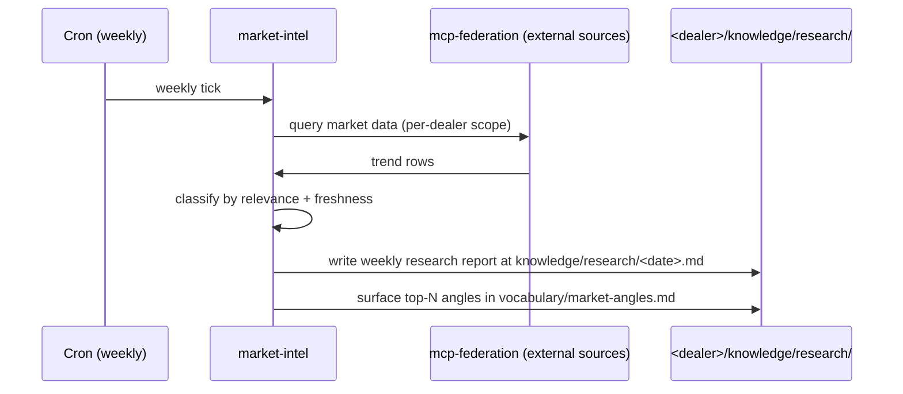

# market-intel

Research agent. Consumes external market data feeds + brand mentions; produces structured angles.

## Sequence

## What it reads at runtime

- External market data via mcp-federation (per-dealer source list).
- Existing research history for trend continuity.

## What it writes at runtime

- Weekly research report (KSG-gated).
- Updated market-angles vocabulary.

## Recovery branches

- **No external sources configured.** Skip; report `no-sources-configured` to operator.
- **Cron skip.** Same as crm-data-guru; manual webhook re-trigger when available.

## Per-dealer customization

- External source list.
- Relevance rubric.

## Status caveat

External market data MCP sources are post-launch (not in Tranche A-G scope).
