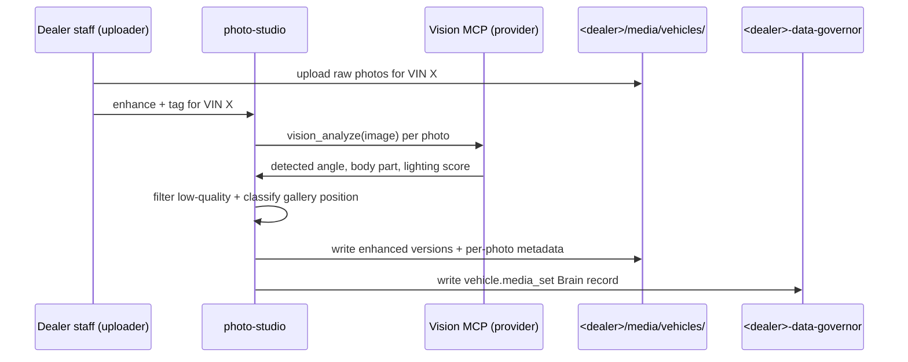

# photo-studio

Vehicle media agent. Takes raw photos in, emits enhanced versions + tagged metadata.

## Sequence

## What it reads at runtime

- Raw uploaded photos at `<dealer>/media/vehicles/<vin>/raw/`.
- Existing vehicle Brain record (for VIN matching).
- Per-dealer photo policy at `<dealer>/knowledge/workflows/vehicle-photos.md`.

## What it writes at runtime

- Enhanced photos at `<dealer>/media/vehicles/<vin>/published/`.
- Per-photo metadata sidecar JSON.
- Brain vehicle.media_set record (DSG-gated).

## Recovery branches

- **Vision MCP unavailable.** Mark batch `pending_enhancement`; retry on next dispatch.
- **Low-quality batch.** Surface to dealer staff with quality-tag breakdown; let them decide whether to republish raw or re-shoot.

## Per-dealer customization

- Photo gallery position policy.
- Quality threshold per dealer brand.

## Status caveat

Vision MCP not in launch scope. Template ships for post-launch media pipeline.
