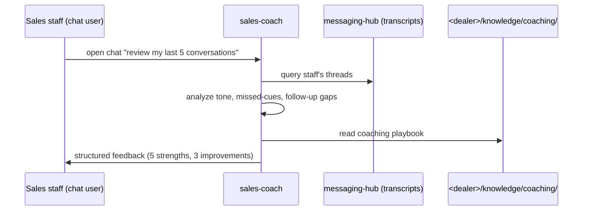

# sales-coach

Inward-facing coaching agent. Dealer-staff-only (not customer-facing).

## Sequence

## What it reads at runtime

- Staff member's messaging-hub threads (scoped to their assigned threads only).
- Per-dealer coaching playbook at `<dealer>/knowledge/coaching/`.
- Tone + intent rubrics.

## What it writes at runtime

- Coaching session transcript.
- Optional: anonymized aggregated coaching report (no per-individual surfacing).

## Recovery branches

- **No threads to review.** Helpful default response (suggest a recent transcript to discuss).
- **Sensitive content (customer PII).** Apply standard PII redaction per `src/server/pii-redactor.ts` patterns before any coaching analysis.

## Per-dealer customization

- Coaching playbook content.
- Per-staff vs aggregated rubric.
