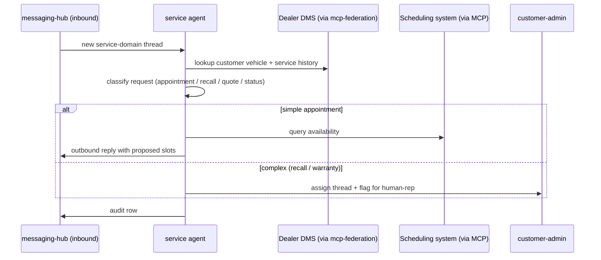

# service

Service-tab agent. Companion to Caroline (SMS) and Elliott (voice); handles non-voice service inquiries.

## Sequence

## What it reads at runtime

- Inbound thread + service-domain tag.
- Per-dealer service vocabulary at `<dealer>/vocabulary/service-intents.md`.
- DMS customer + vehicle records (via mcp-federation when available).
- Scheduling system availability (via MCP, dealer-specific).

## What it writes at runtime

- Outbound replies.
- Brain service-request records (DSG-gated).
- Appointment hold (if scheduling MCP supports it).
- Audit rows.

## Recovery branches

- **DMS federation fails.** Reply with general info; flag thread `dms_lookup_failed`.
- **Scheduling MCP fails.** Reply with phone-based fallback ("please call X to schedule").
- **Complex request misclassified.** Escalate to human-rep on customer's first ambiguity signal.

## Per-dealer customization

- Service intent vocab.
- Scheduling MCP wiring (per dealer's scheduling system).
- After-hours response template.
