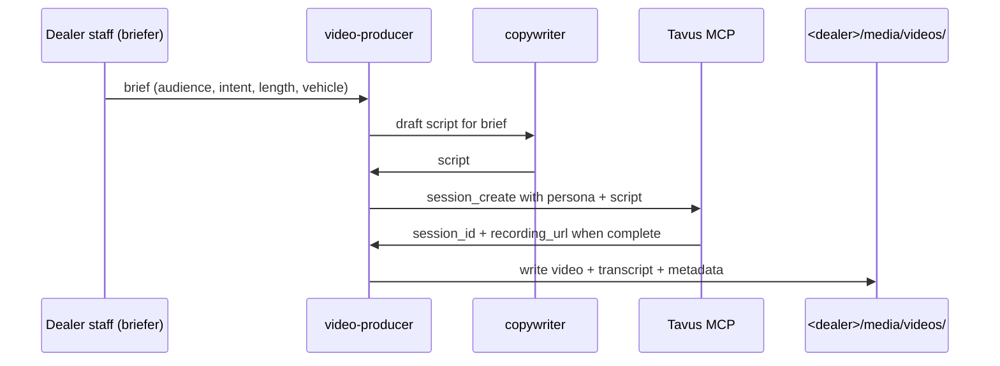

# video-producer

Video media agent. Collaborates with copywriter (script) + photo-studio (B-roll metadata).

## Sequence

## What it reads at runtime

- Dealer brief (chat input or upload).
- copywriter SOUL.
- Per-dealer Tavus persona config.
- Existing vehicle Brain record (if walkaround).

## What it writes at runtime

- Video file + transcript at `<dealer>/media/videos/<id>/`.
- Brain video_asset record (DSG-gated).
- Outbound (optional): post to dealer's marketing channels.

## Recovery branches

- **Tavus unavailable / credentials missing.** Mark brief `tavus_pending`; queue for retry. (`OP-002`)
- **Script needs revision.** Loop back to copywriter; multiple draft iterations.

## Per-dealer customization

- Per-dealer Tavus persona.
- Brand-spot template library.

## Status caveat

Tavus surface is either real or hidden per HTC-NX-004; per-dealer credentials are `OP-002`. Template ships disabled.
