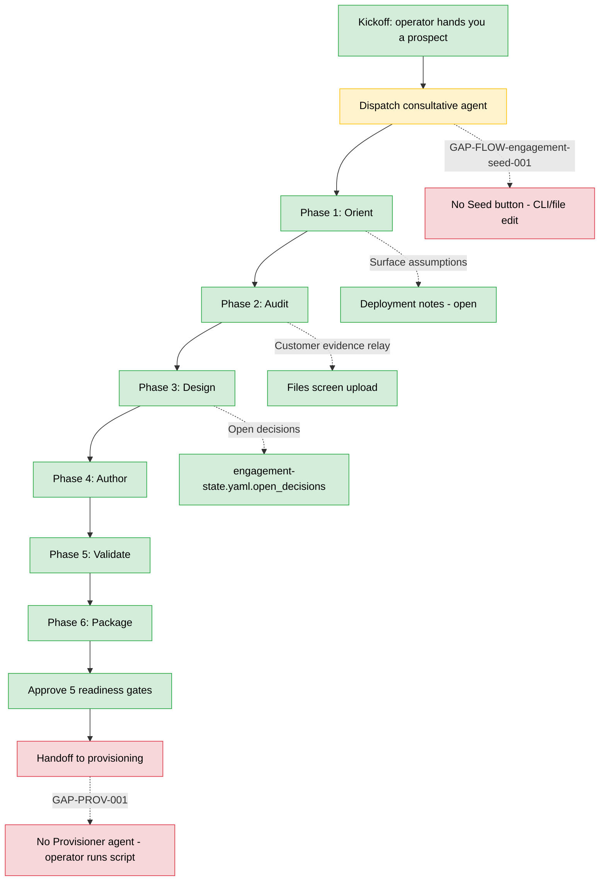

# Consulting human operator guide

**Audience.** A Huminic sales professional using the consultative agent to run end-to-end engagements with prospective and existing customers. Today: also Duane. Tomorrow: a sales rep with `is_admin: true` on the huminic profile but operating inside the engagement loop rather than the system-admin loop.

**Scope.** The six-phase consultative method (orient → audit → design → author → validate → package), the human relay between the agent and the customer, readiness-gate approvals, and the handoff to provisioning.

**How to use.** Walk this manual sequentially the first few times. After that, treat it as a reference. When something doesn't work as written, file a `GAP-FLOW-*` row in `docs/launch/PLAN.md` running log.

---

## Workflow shape

---

## 1. Before kickoff

**What you need.** A prospect identity (company name, contact person, primary contact channel). Any prior-relationship artifacts (email transcripts, prior Nexxus exports, sales-call notes, dealer system credentials if offered). A decided slug for the customer profile (lowercase, hyphens only, DNS-safe).

**Who decides the slug.** You + operator. By convention: the customer's primary brand name in kebab-case (e.g., `serra-automotive`, not `serra` — naming-correction lesson from Phase 1 revised). Stable for the lifetime of the customer — renames are operationally painful.

---

## 2. Dispatch the consultative agent

**Today's procedure** (`GAP-FLOW-engagement-seed-001` — no Studio "New engagement" button):

1. **Create the prospect profile directory** on the production volume. Two paths:
   - **Coolify shell**: `docker exec -it hermes-agent-... mkdir -p /root/.hermes/profiles/<slug>/knowledge/inbox /root/.hermes/profiles/<slug>/knowledge/drafts /root/.hermes/profiles/<slug>/governance /root/.hermes/profiles/<slug>/canon`
   - **OR**: ask the operator to run `scripts/provision-launch-profiles.ts --slug <slug>` with the customer-admin credential left blank for now.
2. **Seed engagement-state.yaml at stage `draft`.** Copy the canonical seed from `~/.hermes/profiles/huminic/engagement-state.yaml` as a template. Edit the customer name + initial deployment_notes (operator-supplied notes about the prospect). Write to `<slug>/engagement-state.yaml`.
3. **Switch active profile in Studio.** `/profiles` → click `consultative-agent` → "Set active".
4. **Open a new chat session against the consultative agent.** `/chat` (or sidebar "Chat") → New session. The system prompt is the consultative-agent SOUL by default.
5. **Hand the agent a goal.** Example: *"Begin engagement orient phase for customer-profile `<slug>`. Customer is `<name>`, primary channel is `<email|phone>`. Read their existing evidence in `<slug>/knowledge/inbox/` (empty for now). Surface initial assumptions as deployment_notes."*

> **Gap.** `GAP-FLOW-engagement-seed-001` — there is no Studio UI button for steps 1+2. Launch-time procedure is the CLI/file-edit above. Post-launch: add a "New engagement" wizard.

---

## 3. The six-phase method

The agent runs the method against the prospect; you act as the human relay between agent and customer. Each phase advances `engagement-state.yaml.current_stage` via the engine call at `consultative-engine.ts:127` (`advanceEngagementStage(input.customer_profile, phaseToStage(phase), {...})`).

### Phase 1: Orient

**Agent does.** Builds an industry brief + strawman solution shape from public Hermes context + Huminic canon. Surfaces 3–8 initial assumptions as `engagement-state.yaml.deployment_notes[]` with `status: open`.

**You do.**
- Read the strawman as soon as it's complete. If the industry framing is wrong (e.g., agent assumed dealership when the customer is dealer-group), inform the agent inline — it'll re-run.
- Resolve any initial assumptions you can answer immediately (e.g., "customer's primary CRM is VinSolutions"). Append to `engagement-state.yaml.deployment_notes[<id>].resolution`. The agent reads these on next dispatch.

**Stage flip.** `draft` → `gathering_data`.

### Phase 2: Audit

**Agent does.** Reads `<customer>/knowledge/inbox/` for any customer-supplied evidence. Builds an existing-state map. Surfaces additional assumptions when evidence is missing or contradictory.

**You do.** Relay customer evidence. Two paths:
- **Inline paste.** If the customer emailed you a transcript or sent you a screenshot caption, paste into the chat. The agent ingests directly.
- **File upload.** `/files` screen → navigate to `<customer>/knowledge/inbox/` → upload the artifact. The agent reads it on next dispatch.

**Stage flip.** `gathering_data` → `solution_discovery`.

### Phase 3: Design

**Agent does.** Designs the agentic topology — which agents the customer will run (Caroline for SMS, Elliott for voice, lead-follow-up, service, etc.) — and the knowledge shape (which wiki pages, which Brain record families). Surfaces topology open-decisions: "voice-first or SMS-first launch?", "AI service desk or human-assisted service desk?".

**You do.** Resolve open decisions. Two paths:
- **In-chat resolution.** Tell the agent "go voice-first, defer Tavus to phase 2". Agent records resolution + adjusts topology proposal.
- **`engagement-state.yaml` direct edit.** Edit `open_decisions[<id>].resolution`. Agent reads on next dispatch.

If a decision is yours-to-make + you don't know yet → say so explicitly. The agent will park the decision + advance partially.

**Stage flip.** `solution_discovery` → `creation`. Readiness gate `topology_decided` proposed for operator approval. **Note:** Gate is `topology_decided` (past tense). The notes field on this gate is `null` per zod schema — do not try to attach a note.

### Phase 4: Author

**Agent does.** Writes the six prescription artifacts into `<customer>/knowledge/inbox/` then promotes to `drafts/` after self-validation:
1. **Client wiki** — the customer's foundational wiki tree with governance + workflow pages.
2. **Agentic-design doc** — list of agents, their SOUL fragments, their workflows, their channel personas.
3. **Data-storage spec** — Brain record families, sources, lineage.
4. **MCP-access spec** — per-channel adapter scope, federation.read_scopes.
5. **KSG spec** — protected trees, canonical pages, frontmatter requirements.
6. **DSG spec** — record-family schemas, reconciliation rules.

Each artifact has required frontmatter (per Artifact_B spec) + an "Impact of Missing Details" section.

**You do.** Spot-check the drafts in `/files`. Focus on the agentic-design doc — is the agent list right for this customer's actual channel mix? Are the SOUL fragments referencing the right channel personas? If something's wrong, tell the agent + it re-authors.

**Stage flip.** `creation` → `submission`. Readiness gate `prescription_approved` proposed for operator approval.

### Phase 5: Validate

**Agent does.** Challenge-loop against each artifact. Scores confidence per artifact. Surfaces remaining gaps as deployment_notes.

**You do.** Read the validation summary. If confidence is high across all six → proceed to package. If anything is below 0.7 → tell the agent to re-design that artifact.

**Stage flip.** `submission` → `feedback`.

### Phase 6: Package

**Agent does.** Bundles the six artifacts + manifest with readiness gates + deployment notes + adjacent_data_neighbors. Sets all 5 readiness gates to `proposed`.

**You do.** Hand the operator the manifest. They approve gates 1–5 per `studio-admin-guide.md` Section 11.

**Stage flip.** `feedback` → `ready_to_run`. Gates: `prescription_approved`, `topology_decided`, `data_storage_approved`, `mcp_access_approved`, `provisioning_ready` all need to flip `approved: true` before handoff to provisioning.

---

## 4. The human relay specification

The consultative agent assumes you are its human relay to the customer. It will:
- Ask you questions intended for the customer (you carry them).
- Surface assumptions for you to either resolve or defer.
- Cite specific evidence pages — when it says "per `<customer>/knowledge/inbox/2026-05-15-call-transcript.md`", it expects that file exists and is what you uploaded.

You should:
- Mark questions clearly when you relay them to the customer ("Customer says: …" in the chat).
- Not paraphrase customer-supplied evidence — paste it verbatim, then add your interpretation as a separate line if needed.
- Treat the agent's stated confidence as honest. If it says it's uncertain, it is. Help it resolve, don't override.

---

## 5. SOUL ↔ engine drift check

**Why this section exists.** `GAP-CONSULTATIVE-DRIFT-001` — the consultative-agent SOUL at `~/.hermes/profiles/consultative-agent/SOUL.md` may have drifted from actual engine behavior at `src/server/consultative-engine.ts`. This guide is an opportunity to flag the drift.

**Engine behavior** (read from code at `consultative-engine.ts:43-130`):
- Phases enumerated. Each phase produces a stage advance via `advanceEngagementStage(profile, phaseToStage(phase), ...)`.
- Imports `advanceEngagementStage`, `phaseToStage`, the engagement-state writer at line 127.

**SOUL claims** (read from `consultative-agent/SOUL.md` and method pages):
- Six phases, deployment-notes mandate, scope contract, approval matrix, prescription overview.
- Lookup-miss assumption surfacing.
- K↔B contract enforcement.

**Drift to verify** (operator/agent should run a one-shot reading session and flag any mismatch). Example checks:
- Does the engine call the deployment-notes API or does it write directly to engagement-state.yaml? If direct write, SOUL claim about "surfacing as deployment_notes" should match the actual write path.
- Does the engine surface lookup-miss as the SOUL claims, or is lookup-miss handled by a different surface (e.g., Brain itself returning a hunch)?

**Action.** If drift is found, file a `DEC` entry in `DECISIONS.log` naming the drift + the chosen resolution (update SOUL OR update engine OR document the split).

---

## 6. Performance engagement variant (PCO)

**Today.** Not implemented as a separate dispatch surface (`GAP-PERF-CONSULTATIVE-001`). Closest substrate: run the consultative agent against an existing customer profile (not a prospect) with a goal like *"Run a performance-review pass against `<existing-slug>`. Read engagement-state history, audit logs, KSG/DSG findings, Brain reconciliation history."*

**The schema is missing a stage.** `engagement-state.yaml` has no `performance_review` stage (`GAP-ENG-STATE-PERF-001`). Launch-time workaround: use the existing `feedback` stage with a deployment_note tagging the pass as performance.

---

## 7. Handing off to provisioning

When all 5 readiness gates are `approved: true`:

1. **Notify the operator.** They run the provisioning script per `studio-admin-guide.md` Section 10.
2. **Stand by during provisioning.** Provisioning may surface unmet preconditions (e.g., customer hasn't returned VinSolutions credentials). Each unmet precondition becomes a deployment_note open entry — operator returns it to you to resolve with the customer.
3. **Verify customer-admin can log in.** Once provisioning is complete, open `/p/<slug>/` in a fresh-localStorage incognito window. Verify the brand renders + login form accepts the provisioned customer-admin credential. If anything is wrong → file a P-FIX with the operator before customer-admin sees it.

> **Gap.** `GAP-PROV-001` — there's no Provisioner agent to dispatch directly. Provisioning is the operator's script-run. The handoff is verbal/chat between you + operator.

---

## 8. Failure & recovery for consulting

### Engagement stalls mid-phase

The customer goes dark, evidence doesn't come back, or you can't get a decision out of them.

**Action.** Park the engagement. Annotate `engagement-state.yaml.deployment_notes[]` with a new open entry: `"Engagement paused YYYY-MM-DD — awaiting <evidence|decision> from customer"`. Don't advance the stage. Don't approve gates. When the customer comes back, resume from where you left off — the agent reads engagement-state.yaml fresh on each dispatch.

> **Gap.** `GAP-ENG-STATE-ABANDON-001` — no terminal `abandoned` stage. If you decide an engagement is dead, leave it frozen + annotate as above. Don't fake an approval.

### Agent makes a wrong design call

The agent proposes voice-first launch + customer told you SMS-first.

**Action.** Tell the agent directly: *"Customer wants SMS-first launch. Re-design with that constraint."* The agent re-enters `solution_discovery` or `creation` as appropriate. Do not edit the prescription drafts by hand — the agent owns those.

### Customer wants something out of scope

Customer asks for a capability that the prescription doesn't include (e.g., a custom dashboard the consultative process doesn't build).

**Action.** Flag the request to the operator. They decide: accept as scope expansion (extend prescription) OR defer to post-launch (record as `engagement-state.yaml.deployment_notes` with `status: deferred`). Document the decision in `DECISIONS.log`.

### Gate approval blocked because operator unavailable

Gates require operator approval. If the operator is unavailable + engagement is time-sensitive: do not self-approve gates. The Environmental Core Values rule #5 (no self-approval) applies even under deadline pressure.

**Action.** Park the engagement at the current stage + flag the operator-needed approval in `engagement-state.yaml.deployment_notes`. The customer-facing communication is: "Approval pending; we'll resume on operator availability."

---

## 9. Cross-references

- Workflow ids covered: `WF-CHO-001` through `WF-CHO-005`, plus `WF-CON-001` through `WF-CON-005` (since you are the relay for the agent's workflows).
- Companion: `studio-admin-guide.md` Sections 11 (gate approval), 10 (provisioning), 14 (deployment).
- Agent SOUL: `~/.hermes/profiles/consultative-agent/SOUL.md`.
- Method pages: `consultative-agent/knowledge/method/{orient, audit, design, author, validate, package}.md` + `build-time-crew.md` + `run-time-crew.md`.
- Engine code: `src/server/consultative-engine.ts`.

---

## Gaps surfaced during consulting-human-operator-guide.md drafting

No NEW gaps surfaced in this manual. The drafting did confirm existing GAP-* rows + adjusted their launch-time workaround language:

- `GAP-FLOW-engagement-seed-001` — Section 2 (CLI/file-edit launch procedure)
- `GAP-CONSULTATIVE-DRIFT-001` — Section 5 (drift-check protocol now spelled out)
- `GAP-PERF-CONSULTATIVE-001` + `GAP-ENG-STATE-PERF-001` — Section 6 (workaround: use `feedback` stage + tagged deployment_note)
- `GAP-PROV-001` — Section 7 (handoff is verbal/chat)
- `GAP-ENG-STATE-ABANDON-001` — Section 8 (workaround: freeze + annotate)
