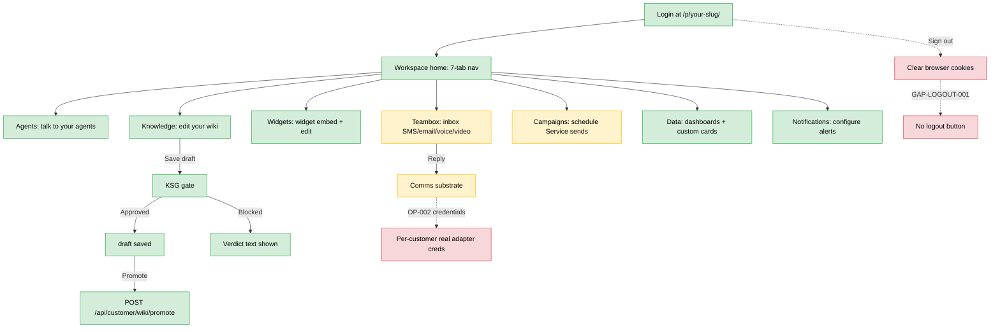

# Customer-admin guide

**Audience.** A dealer principal, GM, or designated staff member with `is_customer_admin: true` on your dealership's profile. You log in at `https://studio.huminic.app/p/<your-slug>/` — not at the bare Studio URL.

**What you can do.** Hold conversations with your dealership's AI agents (Agents tab), edit your wiki within governed bounds (Knowledge tab), manage your widget embeds (Widgets tab), view and build custom dashboards (Data tab), reply to inbound customer messages across SMS/email/voice/video (Teambox tab), schedule service campaigns (Campaigns tab).

**What you can't do.** Touch other dealers' data. Edit your canonical knowledge directly (canon updates go through your account manager). Send outbound to recipients outside your allowlist. Approve your own readiness gates on engagements.

---

## Workflow shape

---

## 1. First login

**Where to log in.** `https://studio.huminic.app/p/<your-slug>/`. Replace `<your-slug>` with what your account manager gave you (examples: `huminic-motors`, `serra-honda`, `ford-of-columbia`). The dealership home page (your branded landing) renders without authentication; clicking any of the 6 tabs prompts the login form.

**First-time credential.** Your account manager will send you a temporary password through the agreed secure channel (never in plain email). You'll be asked to set a new password on first login via the reset flow.

**Reset your password.**
1. POST to `/api/auth/reset-request` with `{"email": "<your-username>"}`. The simplest way: click "Forgot password?" on the login form (which makes the same request). You always get a 200 response — this is anti-enumeration, not a bug.
2. Check your email for a single-use reset link. Token is valid 15 minutes.
3. Click the link, land on `/reset?token=<x>`, enter new password + confirm.
4. Sign in at `/p/<your-slug>/` with the new password.

**Sign out.** No "Sign out" button exists today (`GAP-LOGOUT-001`). Workaround: open your browser DevTools → Application tab → clear cookies for `studio.huminic.app`, then refresh. Or use an incognito session for short-lived work.

**Single-user-per-profile.** Today, one `auth.yaml` = one user per dealership. You cannot invite additional staff users to share your Workspace — your account manager has to provision them via CLI (`GAP-CUSTOMER-INVITE-001`).

---

## 2. The 7 tabs

After login, the Workspace shell renders a left nav with 7 tabs. Which tabs are visible depends on your `studio.yaml` menu visibility flags (your account manager set these during provisioning). At launch all dealer Workspaces have:

- **Agents** (Chat) — visible
- **Knowledge** — visible
- **Widgets** (Tools) — visible
- **Data** — visible with dashboards and custom dashboard builder
- **Teambox** (Comms) — visible
- **Campaigns** — visible (Service sub-page only per operator decision 2026-05-29)
- **Notifications** — visible

---

## 3. Agents tab

**What it does.** Lets you hold a multi-turn conversation with any agent on your dealership's roster.

**Click path.**
1. Click "Agents" in the left nav.
2. The right pane shows an agent picker — a list of your dealership's agents pulled from `<your-slug>/governance/agents/*.md`. Each row shows: agent name, role one-liner, channel persona.
3. Click an agent → new session opens. The chat input is at the bottom; the agent's first message is its greeting from its `chat.md` persona fragment.
4. Type a question → Enter. Conversation persists in messaging-hub as `channel: chat`, `domain: chat`.

**Which agents you'll see.** At launch most dealers have placeholder agent SOULs marked `enabled: false`. Visible-and-enabled at launch varies per dealer. Huminic Motors has Elliott (the inbound service-call handler) live. Other dealers' agent rosters depend on their per-dealer enablement schedule with the account manager.

**What chats are NOT for.** Don't paste private customer PII into the chat as if it were a private notepad — every chat persists into messaging-hub. The chat IS your operational record; treat it that way.

---

## 4. Knowledge tab

**What it does.** Lets you edit your dealership's wiki content under bounded, governed paths.

**What you can edit.**
- `knowledge/inbox/` — your scratch space; nothing is canon until you promote it.
- `knowledge/drafts/` — works-in-progress.
- `knowledge/published/` — your dealership's canonical pages. Edits here require gate approval.
- `knowledge/widgets/` — widget config files; also editable via the Widgets sub-page.

**What you cannot edit.**
- `canon/` — Huminic-the-company's canonical knowledge. Read-only on your path.
- `governance/` — your dealership's governance policy + agent SOULs. Read-only; ask your account manager for changes.
- `archive/`, `.git`, `db` — system paths.

**Click path.**
1. Click "Knowledge" in the left nav.
2. Tree-view of your editable paths in the left pane.
3. Click a markdown file → editor opens on the right. Frontmatter shows as a structured panel above the body.
4. Edit body and/or frontmatter → "Save".

**What happens on Save.**
- KSG runs synchronous pre-checks: protected-tree denial, canonical-frozen denial (you can't overwrite a file with `status: canonical` frontmatter), missing-frontmatter denial (`type`, `status`, `title` are required).
- On success: file saved. A `metadata_audit` row written to your Brain for traceability.
- On failure: editor shows a red verdict bar — *"protected-tree: governance/ is read-only on the customer-admin path. Edit via the operator console."* Fix the path or content and retry.

**Promoting a draft to published.**
1. Open the draft in the editor.
2. Click "Promote" → confirms inbox → drafts → published order. KSG validates the move.
3. On success: file moves to `knowledge/published/`. Canon page is live.

**Concurrent edits.**

> **Gap.** `GAP-FLOW-concurrent-edit-001` — confirmed today: the KSG gate has no concurrent-edit detection. If you and your account manager both edit the same page in the same minute, the last save wins silently. No conflict prompt. At launch the convention is: one writer at a time per page. If you suspect a conflict, ask your account manager via your normal channel before saving.

---

## 5. Widgets tab

**What it does.** Lets you see your widget embeds, copy the snippet for your site, and edit greeting/agent-assignment/color.

**Click path.**
1. Click "Widgets" in the left nav.
2. Sub-nav: "Widget" (always visible) + "Consult" (huminic profile only — flips on if `studio.yaml.widgets.consult: true`).
3. Widget sub-page lists each widget you own: name, status (`ready` / `missing-file` / `misconfigured`), live preview iframe, embed snippet, edit form.
4. Click a widget row → edit form: greeting, accent color, agent assignment.
5. "Save" → KSG runs (same rules as Knowledge tab) → writes back to `knowledge/widgets/<slug>.md`.

**Copying the embed snippet.** Click the "Copy" button next to the snippet. Paste into your website's HTML where you want the widget to render. The snippet points at `https://studio.huminic.app/customer-console/embed.js` (the hosted bundle) and identifies your widget by slug.

**Public widget URL.** Each widget has a public URL: `https://studio.huminic.app/w/<widget-slug>`. Test it in an incognito window — should render without authentication.

**Channel modes.** Each widget has a `mode` in its frontmatter: `chat`, `voice`, `video`, `form`. Chat mode works for all dealers at launch. Voice, video, and form modes require per-dealer adapter credentials (`OP-002`); status shows `unconfigured` on the widget row until your account manager provisions credentials.

### The unified widget ("Choose how to connect")

**What it is.** The floating round button that can be embedded on your public website. Anyone visiting the page — no login — can click it to open a menu titled "<Store> · Choose how to connect" with up to four ways to reach you:

| Option | What the visitor gets | Where it lands for you |
|---|---|---|
| **Web Chat** | Live chat with your sales AI assistant | A chat thread in **Teambox → Sales** |
| **Instant Call Back** | Leaves their name + phone asking you to call back | A **Call-back request** lead in Teambox (Sales) **+ a notification email** to your BDC. (No text message is sent — it just alerts you to call them.) |
| **Contact Form** | Your contact form | A lead in Teambox (Sales) **+ a notification email** |
| **Two-Way Video** | A live face-to-face video session with your AI agent | A video thread in Teambox **+ a notification email** |

**Where it works.** Self-hosted on your own external site (dealer.com or similar) via one script tag — ``. The full per-store URL list is in `docs/launch/WIDGET_URLS.md`.

**Configuration.** Which options appear, the accent color, and the video agent are set by your account manager in `studio.yaml` under `unified_widget` (operator-controlled — not customer-editable). The five sales stores (Serra Honda, Serra Nissan, Tony Serra Ford, Hyundai of Columbia, Ford of Columbia) present **Web Chat, Instant Call Back, Contact Form, and Two-Way Video**; **Serra Service presents Web Chat, Instant Call Back, and Contact Form — Two-Way Video is off by design** for the service rooftop. The video agent's display name is configured per store. Channel options use customer-friendly language like "Web Chat", "Instant Call Back", "Contact Form", and "Two-Way Video". (Two-Way Video is render-verified across the sales stores; the live face-to-face handoff is confirmed during the walkthrough before it's called final.)

---

## 6. Data tab

**What it does.** Shows dashboards for your dealership's metrics and activity. You can view pre-built dashboards and create custom dashboard cards using the dashboard builder.

**Click path.**
1. Click "Data" in the left nav.
2. View available dashboards showing your metrics, leads, campaigns, and activity.
3. Use the custom dashboard builder to add, configure, and restore custom data cards.
4. Cards persist to your Brain and are available across sessions.

**Custom dashboards.** The dashboard builder allows you to create custom data cards from available sources. These cards are stored in your dealership's Brain database and can be added or restored via the dashboard API.

---

## 7. Teambox tab

**What it does.** Shows your inbound + outbound messages across all channels in a unified inbox. Split into Sales and Service segments per `domain` tag.

**Click path.**
1. Click "Teambox" in the left nav.
2. Three-column layout: segment switcher (Sales | Service) — thread list — thread detail + composer.
3. Click a thread → detail opens. Each message shows a channel chip (📧 email, 💬 SMS, 📞 voice, 🎥 video) + the contact card + assigned-agent badge (if a runtime agent is on the thread).
4. Type a reply in the composer → pick reply channel → "Send". Comms substrate enforces rate-cap + allowlist, then dispatches via the right adapter.

**Keyboard nav.** `j` next thread, `k` previous, `r` reply.

**SSE live updates.** As inbound arrives, the thread list re-orders + new messages append in the detail view without refresh. If you see an agent's typing indicator, that's a runtime agent (Caroline, Elliott, etc.) replying autonomously per their subscription rules.

**Per-customer real credentials.**

> **Gap.** `OP-002` — until your account manager provisions your real SMS, voice, video, and email service credentials, outbound dispatch returns `unconfigured` on those channels. You'll see the failure in the audit log + a status badge on the thread.

**ADF email inbound.** If your dealership receives leads as ADF-formatted email from a third-party lead provider, the Teambox system parses ADF automatically and tags the thread `channel: email-adf`, `domain: sales`, with `lead_meta` extracted (customer name, vehicle of interest, trade, etc.). You'll see the parsed fields inline on the inbound message.

---

## 8. Campaigns tab

**Scope.** Service campaigns only at launch (per operator decision 2026-05-29 — Sales campaigns dropped from launch scope).

**What you can do.** Build an audience from your contacts, pick a Service template (Service Recall, Service Due, Follow-up Lead), schedule the send, watch deliveries land in Teambox as replies.

**Click path.**
1. Click "Campaigns" in the left nav.
2. Campaign list view (left) + builder (right).
3. "New campaign" → pick template → builder opens.
4. Build audience: simple DSL filters (channel = SMS, last contact > 90 days, etc.).
5. Preview the audience → "Schedule send" → pick send time.
6. Send time arrives → campaign worker ticks the campaign → one Message per Contact dispatched via the right adapter.
7. Replies land in Comms as inbound threads tagged with the campaign.

**Campaign templates.** Seeded at provisioning under `<your-slug>/campaigns/templates/` — you can copy + customize them in the builder.

---

## 9. Notifications tab

**What it does.** Configure who gets alerted when specific events occur — new leads, inbound calls, Guardian conditions, etc.

**Click path.**
1. Click "Notifications" in the left nav.
2. View existing notification rules and their recipients.
3. Add or edit notification routes to map events to recipients + channels.

**Notification channels.** Email (plain or ADF-XML format), SMS (where configured), internal dashboard alerts.

---

## 10. Failure & recovery for the customer-admin

### KSG blocks a save you thought was valid

Read the verdict text — it names the rule that fired. Common cases:
- **protected-tree** → you're trying to edit `governance/` or `canon/`. Move the edit to `knowledge/drafts/`.
- **canonical-frozen** → the file has `status: canonical` frontmatter. You can't overwrite it. Ask your account manager to update canon.
- **missing-frontmatter** → add `type`, `status`, `title` to the frontmatter block at the top.

### Send failure on outbound (Teambox)

Check the thread for a status badge (`failed`, `unconfigured`, `rate_cap`, `allowlist_denied`).
- `unconfigured` → adapter credentials not provisioned. Tell your account manager (`OP-002`).
- `rate_cap` → wait the cap window + retry.
- `allowlist_denied` → recipient not in your dealership's allowlist. Ask account manager to add.
- `failed` → external provider issue. Check the audit log in your account manager's surface; manual re-dispatch may be needed.

### Password reset link expired

Tokens are valid 15 minutes. Request a new one — POST `/api/auth/reset-request` again (or click "Forgot password" again). Rate-limited to 3 requests per minute per IP.

### Concurrent-edit silent overwrite suspected

You saved a draft + later it looks like your changes are missing. Check git history via your account manager — every save is committed to the profile's git repo. Recover the lost content if needed; talk to account manager about coordination.

### Workspace not rendering correctly (brand wrong, tiles wrong)

Likely a `studio.yaml` schema fallback like P-FIX-003. Ask your account manager to verify your `studio.yaml` uses `branding.persona_name` (not `brand.display_name`) and your menu visibility flags are set correctly. Fix is on the production volume + a redeploy.

---

## 11. Cross-references

- Workflow ids covered: `WF-CA-001` through `WF-CA-008`, plus `WF-F&R-002`, `WF-F&R-005`.
- Companion: `studio-admin-guide.md` (your account manager's side).
- Public widget URLs: `https://studio.huminic.app/w/<widget-slug>`.
- Workspace entry: `https://studio.huminic.app/p/<your-slug>/`.

---

## Gaps surfaced during customer-admin-guide.md drafting

`GAP-FLOW-concurrent-edit-001` **confirmed** as silent-overwrite at launch — the KSG gate (`src/server/ksg-gate.ts`) has no collision detection. Launch-time procedure documented in Section 4 (single writer at a time per page). Post-launch: add ETag-style optimistic concurrency to the wiki save endpoint.

No NEW gaps surfaced beyond confirming the investigate-row. Existing gaps referenced:

- `GAP-LOGOUT-001` (Section 1, 9)
- `GAP-CUSTOMER-INVITE-001` (Section 1)
- `GAP-FLOW-concurrent-edit-001` (Section 4, confirmed)
- `OP-002` (Section 7, 8 — per-customer credentials)
