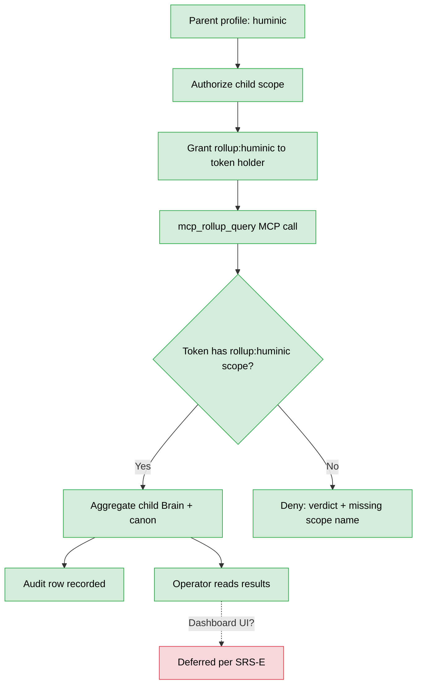

# Huminic rollup operator guide

**Audience.** A human operating *Huminic the company* who needs to read aggregated data across child profiles. Today there is one parent (Huminic) and one launch-scope child (Huminic Motors); the rollup mechanism is the same for any future parent–child profile relationship.

**Scope.** Authorizing rollup scope grants, executing rollup queries via the `mcp_rollup_query` MCP tool, auditing rollup reads, and understanding what's deferred to post-launch (the rollup dashboard UI).

**Smaller manual.** This is the smallest of the five — the rollup substrate is narrow at launch (no dashboard UI yet) but the authorization model + audit trail are real.

---

## Workflow shape



---

## 1. Parent–child profile model

**Huminic is itself a profile** — `~/.hermes/profiles/huminic/`. It is also the *parent* under which Huminic Motors (and future child dealerships) report. The parent–child relationship is declared explicitly in Huminic's `governance/rollup-scope-grants.md` (or equivalent — exact location depends on the post-launch grants doc being written; today the model is encoded directly in the `rollup:<parent>` scope semantics).

**At launch, the child registry is:**
- `huminic-motors` is the canary child for the rollup mechanism.
- Future: other dealerships, but those are operator-decisions per dealer enablement.

Other dealers under launch scope (`serra-honda`, `serra-nissan`, etc.) are NOT children of `huminic` — they are independent customer profiles. Rollup queries against them require *federation* (cross-tenant authorized read per `WF-FED-001`), not rollup.

The distinction matters:

| Relationship | Mechanism | Auth model |
|---|---|---|
| Parent reads from its declared child | `mcp_rollup_query` with `rollup:<parent>` scope | Pre-authorized by parent–child declaration |
| Independent peer reads from another peer | `federated_search` with target's `federation.read_scopes` | Per-target explicit scope grant naming the caller |
| Operator reads anything | Admin scope MCP token | Operator-level authorization (top of stack) |

---

## 2. Authorizing rollup scope

**Today's procedure.** The `rollup:<parent>` scope is granted at the MCP token registry level. The token holder (a human operator or a script with the right MCP token) can call `mcp_rollup_query` only if their token carries `rollup:huminic` in its scope set.

**Click path** (operator-side, via Studio admin):

1. `/mcp-tokens` (admin-only).
2. Create or edit a token → in the scope set, add `rollup:huminic`.
3. Save → the token can now call `mcp_rollup_query` with parent identifier `huminic`.

> **Note.** The full granular scope model (e.g., `rollup:huminic:brain-only`, `rollup:huminic:no-pii`) is post-launch. At launch, `rollup:huminic` grants read of every child profile's Brain + published canon.

---

## 3. Executing a rollup query

**Tool.** `mcp_rollup_query` — invoked via any MCP client that holds the right scope. The Studio admin chat UI is one entry point; direct API call is another.

**Invocation pattern** (Studio admin chat, profile = huminic, agent with admin MCP token):

```
User: Run mcp_rollup_query against parent=huminic with query "count messages per child per day for last 7 days, group by channel and domain"

Agent: <calls mcp_rollup_query with parent=huminic, query=...>
Result:
  huminic-motors:
    2026-05-26: {sms: 14, voice: 7, chat: 23}
    2026-05-27: {sms: 18, voice: 9, chat: 31}
    ...
```

The tool aggregates across each child profile's `messaging-hub.db` + `brain/brain.db` per the query scope. The exact query DSL is documented in the federation-MCP design doc + `mcp_rollup_query` MCP tool description (accessible via the Studio MCP catalog at `/mcp-tokens`).

**Direct API form.** Useful for scripted reports:

```bash
curl -X POST https://mcp.huminicdev.com/dax/mcp \
  -H "Authorization: Bearer $ROLLUP_TOKEN" \
  -H "Content-Type: application/json" \
  -d '{"method": "tools/call", "params": {"name": "mcp_rollup_query", "arguments": {"parent": "huminic", "query": "..."}}}'
```

---

## 4. Audit + denial behavior

**Every rollup query writes an audit row.** Filter `/audit` by `action_type = ROLLUP_QUERY` to see all rollup reads — caller, parent, query summary, row count, latency.

**Denied queries.** If the calling token doesn't carry `rollup:<parent>` scope, the call fails with a verdict naming the missing scope:

```
{"ok": false, "error": "rollup scope required", "missing_scope": "rollup:huminic"}
```

This matches the cross-tenant denial behavior validated in Tranche F.9 pen-tests (13/13 vectors blocked).

**Operator action on denial.** If the denial is unexpected (you thought your token had the scope), check `/mcp-tokens` → your token's scope set → add `rollup:<parent>` if missing → re-issue if rotated.

---

## 5. What is NOT in scope at launch

### Rollup dashboard UI

> **Gap.** Per `SRS-E` disposition (`DECISIONS.log` 2026-06-01T07:55:00Z): the dashboard UI for `mcp_rollup_query` is deferred. Couples with `D-3` plugin-native renderer. No customer-visible artifact; operator queries via MCP token only.

What you cannot do at launch:
- Open `/rollup` in the browser and see a pre-built rollup dashboard.
- Schedule rollup reports to auto-deliver to email.
- Save named rollup queries for reuse via UI (workaround: save the query as a shell script using the curl pattern above).

What you CAN do at launch:
- Execute rollup queries via MCP tool call in any Studio admin chat session.
- Execute rollup queries via direct API curl.
- Read audit log of all rollup queries via `/audit`.

### Granular sub-scopes

`rollup:huminic:brain-only`, `rollup:huminic:no-pii`, `rollup:huminic:financial-only` etc. — all post-launch.

### Two-way rollup writeback

Rollup is read-only. No mechanism for parent to push canonical updates back down to children. If you need to do that today: operator does it per-child via direct file edit on the production volume.

---

## 6. Failure & recovery

### Rollup query times out

Most likely the query is too broad (e.g., "all messages, all time, all channels" across many children).

**Action.** Narrow the query — add a time range, narrow the channels, limit row count. Retry.

### Audit shows rollup queries you don't recognize

Token compromise possibility.

**Action.** Rotate the rollup-scoped MCP token immediately (`/mcp-tokens` → token row → "Rotate"). Old token is revoked; new one issued. Re-issue to legitimate consumers. Investigate the unrecognized caller via `/audit` source IP + timestamps.

### Child profile schema_version mismatch

If a child profile's `brain/brain.db` is on a different `schema_version` than the parent expects, rollup may return partial or empty results.

**Action.** Check the child's brain schema via `GET /api/brain/readiness?profile=<child>` (which returns the schema version). If mismatch, the operator must run the relevant migration on the child profile (per Tranche A brain migration path).

### Rollup returns data from a child profile that shouldn't be there

You see rollup results aggregating a profile that isn't actually a child of huminic.

**Action.** This would be a serious authorization bug. Stop further rollup queries immediately, capture the verdict + audit row, alert the operator. Tranche F.9 pen-tests validated the deny path; an unexpected pass would indicate a regression.

---

## 7. Cross-references

- Workflow ids covered: `WF-RLP-001`, `WF-RLP-002`, `WF-RLP-003`, plus rollup-related rows from `WF-OP-005` (token rotation).
- Companion: `studio-admin-guide.md` Section 7 (MCP tokens) + Section 9 (audit).
- MCP tool reference: `mcp_rollup_query` — listed in `/api/mcp-catalog` (admin-only) or queryable via `tools/list` on the central-mcp endpoint.
- Federation companion (different mechanism): `docs/federation-mcp-design.md`.

---

## Gaps surfaced during huminic-rollup-operator-guide.md drafting

No new GAP-* rows surfaced. The dashboard-deferral is already captured in `DECISIONS.log` as the SRS-E disposition; this manual just makes the launch-time workaround procedure explicit (Section 5).

Existing dispositions referenced:

- `SRS-E disposition` (Section 5 — dashboard deferred, MCP-only access at launch)
- `Tranche F.9` (Sections 4, 6 — pen-test validated deny path)
