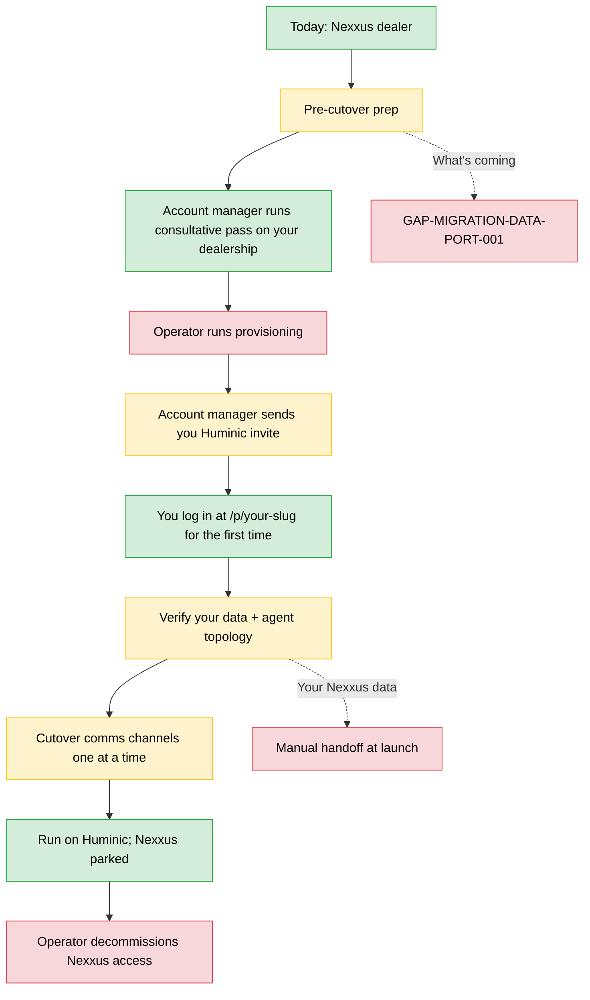

# Nexxus migration customer guide

**Audience.** An existing Nexxus dealer transitioning to Huminic Studio. The person reading this is a dealer principal, GM, BDC lead, or designated power-user — *not* the car-shopping end-consumer. (If you are an end-consumer who landed here by accident: this guide is for your dealership's staff. Talk to them about whether your dealership is on Huminic.)

> **Assumption flag.** This manual is written assuming dealer-side migration. If the operator intended this to be the *end-consumer* migration manual, surface that mismatch — the contents will need substantial revision.

**Scope.** What's different between Nexxus and Huminic from a dealer-staff perspective, where your old data is (and isn't), how to do the things you used to do, and the cutover steps from your side.

**Companion.** Read `customer-admin-guide.md` first — that's the full Huminic Studio Workspace manual. This guide overlays the migration-specific parts on top.

> **Terminology.** **Workspace** = your staff/store operating area (where you log in and work). **Storefront** = the customer-facing widget/notification layer your shoppers see. They are different surfaces; this guide keeps them distinct.

---

## Workflow shape

---

## 1. What changes from Nexxus

### Same in spirit

- AI agents handle inbound calls/messages and surface leads to your CRM (Elliott, Caroline, lead-response, etc.).
- Service campaigns go out on a schedule (Service Recall, Service Due, Follow-up Lead templates).
- Unified inbox across SMS / email / voice / video.
- Agents are configurable per dealership.

### Different

- **Wiki-first workflows.** In Nexxus, business logic lived inside agent prompts + custom code. In Huminic, business logic lives in *wiki pages* you can read and edit (under the Knowledge tab). When an agent does something, it's reading a wiki page you can inspect.
- **Workspace URL.** You log in to your staff **Workspace** at `https://studio.huminic.app/p/<your-slug>/`. Each dealership has its own Workspace; you don't share a multi-tenant dashboard. (Your customer-facing widget/notification layer — the **Storefront** — is a separate, public surface.)
- **Knowledge gates (KSG/DSG).** Your edits go through a *semantic guardian* that enforces governance rules. You'll see verdict text on rejected saves with a specific reason. This isn't a bug — it's the policy your account manager and you co-authored during the consultative engagement.
- **Seven-tab IA** (Agents, Knowledge, Widgets, Data, Teambox, Campaigns, Notifications). The old Nexxus 4-tab IA (Chat/Dashboard/Widget/Service) doesn't map 1:1 — see Section 3 for the new mapping.
- **Data tab includes dashboards and custom dashboard builder.** At launch you can view your dealership's metrics and create custom dashboard cards. Additional Metabase integration planned post-launch (Phase C.9 deferred).
- **Service campaigns are the immediate launch focus.** The campaign engine is built once and shared; Service runs first, and Sales-store campaign parity is staged to follow where expected — it is not permanently dropped. If you ran Sales campaigns in Nexxus, coordinate timing with your account manager.
- **Teambox is live (verified).** Huminic's **Teambox** tab is your unified inbox and human-takeover surface — verified working at launch. If you used Nexxus's TeamBox for human-rep collaboration on threads, the equivalent here is Teambox plus agent-autonomous-reply subscriptions and thread assignment. Different UX; functionally similar for the most common workflows.

---

## 2. Where your old data is

### Lead history + thread history

> **Gap.** `GAP-MIGRATION-DATA-PORT-001` — the Nexxus → Huminic Brain data migration is **operator-owned and post-launch**. At launch, your historical lead + thread data stays in Nexxus. Your Huminic Brain starts fresh with new inbound from the cutover date forward.

What this means at launch:
- New inbound from cutover forward → lands in Huminic Comms.
- Old leads + threads from before cutover → still queryable in Nexxus until the operator decides to decommission your Nexxus access.

Your account manager will coordinate when (and whether) to bulk-import historical Nexxus data into your Huminic Brain. This is a per-dealership decision based on volume + retention need.

### Customer contacts

Same gap. Your contact deduplication starts fresh in Huminic at cutover. If a customer was a known contact in Nexxus and reaches out to your Huminic comms channel post-cutover, Huminic will create a *new* contact for them. Once historical data is ported, the duplicates will reconcile (or you can manually merge).

### Wiki content (if you authored Nexxus knowledge pages)

If your dealership had custom knowledge pages in Nexxus, they will be ported as part of the consultative engagement's `author` phase — your account manager will lift the relevant content into your new Huminic wiki under `<your-slug>/knowledge/`. Not all Nexxus content ports verbatim; some of it may be re-written to match Huminic's wiki-spec frontmatter.

### Agent personalities / custom prompts

Personalities for ported agents (Caroline, Elliott, etc.) come from the consultative engagement's `design` phase — your account manager designs the agent topology + channel personas for your dealership during the engagement. Your old Nexxus agent prompts are *inputs* the consultative agent reads, not direct ports.

### CRM data (VinSolutions, etc.)

Your CRM stays where it is. Huminic federates *into* your CRM via per-dealer MCP scopes (per the prescription's MCP-access spec). No CRM migration; Huminic just talks to your existing CRM.

---

## 3. New IA mapping (Nexxus → Huminic)

| Nexxus surface | Closest Huminic tab | Notes |
|---|---|---|
| Chat with assistant | Agents | Agent picker + multi-turn session. |
| Dashboard / metrics | Data | Dashboards + custom dashboard builder at launch; additional Metabase integration post-launch. |
| Widget editor | Widgets / Widget sub-page | Same idea; per-widget greeting / agent / mode / channel. |
| Service queue | Teambox (Service segment) + Campaigns (Service templates) | Split between read (Teambox Service tab) + author (Campaigns Service templates). |
| Inbox (unified) | Teambox | Three-column inbox; keyboard nav; SSE updates. |
| TeamBox | Teambox thread assignment + agent subscriptions | Different UX. Human-rep handoff via subscription rules + thread assignment, not a separate team-collab panel. |
| Custom dashboards | Data | Dashboard builder available at launch for creating custom data cards. |
| Sales campaigns | Campaigns | Service is the immediate focus; Sales-store parity staged to follow where expected. |
| Service campaigns | Campaigns / Service sub-page | Service Recall / Service Due / Follow-up Lead templates. |
| Knowledge base / FAQ | Knowledge | Wiki-first; KSG-gated. |

---

## 4. Pre-cutover prep (your side)

Before your account manager runs the consultative pass:

1. **Inventory your active Nexxus capabilities.** Which agents do you actually use? Which campaigns? Which inbound channels? Which CRM integrations? Write a short list — your account manager will ask.
2. **Decide your cutover sequence.** All at once OR one channel at a time? Most dealers do one channel at a time (start with SMS, then add voice, then add video). Faster rollback if something goes wrong.
3. **Gather your channel credentials.** SMS service API keys, voice assistant configuration, video service IDs, and email domain verification. Your account manager will need these to provision your Huminic adapters (`OP-002`).
4. **Identify your power users.** Who will be your dealership's customer-admin on Huminic? At launch only one user per dealership profile (`GAP-CUSTOMER-INVITE-001`). Pick the person who will own the Huminic surface.
5. **Park any in-flight Nexxus customizations.** If your dealership was mid-rollout of a Nexxus customization, finish or abandon it before cutover. The consultative engagement assumes a stable starting state.

---

## 5. The consultative engagement (your account manager's pass)

Your account manager runs the consultative agent against your dealership. From your side:

1. **Onboarding call.** Account manager interviews you about your operations — same questions you'd answer for any vendor onboarding. They take notes; the notes feed the consultative agent.
2. **Evidence relay.** You may be asked to share: a recent week's Nexxus dashboard screenshot, a typical service campaign template, an example inbound lead, your CRM data export sample. Your account manager uploads these to `<your-slug>/knowledge/inbox/`.
3. **Decision questions.** The consultative agent will surface decisions (e.g., "voice-first or SMS-first launch?") — your account manager will relay these to you. Answer in your own time; no rush.
4. **Prescription review.** When the consultative agent finishes the `package` phase, your account manager will walk you through the prescription — the agentic-design doc (which agents you'll get), the data-storage spec (what gets indexed in your Brain), the MCP-access spec (what external systems Huminic talks to on your behalf). Approve OR request changes.
5. **Readiness gates.** Five gates need operator approval before provisioning kicks off. Your role here is: review + give the green light.

Timeline: typically 1–2 weeks from onboarding call to readiness for provisioning. Customer-readiness gates can stretch that if you need decision-time.

---

## 6. Provisioning + first login

Once gates approved:

1. **Operator runs provisioning** (today via script; tomorrow via Provisioner agent — `GAP-PROV-001`). Takes ~10 minutes for a clean provision.
2. **You get your customer-admin credential + Workspace URL** through the agreed secure channel (not plain email).
3. **Reset your password** on first login (per `customer-admin-guide.md` Section 1).
4. **Verify your Workspace renders correctly.** Brand name, accent color, persona name in the header should match your dealership. If something's wrong, tell your account manager immediately — schema fallback (`P-FIX-003`-style) is the most common issue and easy to fix at this stage.
5. **Verify your agent roster** under the Agents tab. Should match the agentic-design doc from the consultative prescription. Agents `enabled: false` will not appear; that's intentional — your account manager flips them on per the rollout sequence.

---

## 7. Channel cutover sequence

Per channel, the procedure is:

1. **Provision the adapter** — your account manager sets the per-dealer real credentials in the system configuration + redeploys.
2. **Test inbound.** Send yourself a test inbound (an SMS to your phone number, a test call, etc.). Verify it lands in your Comms tab.
3. **Test outbound.** Send yourself a test outbound from the Comms composer. Verify it reaches you on the channel.
4. **Configure agent subscriptions.** Decide which agents handle inbound on this channel autonomously vs. monitor-only. Subscription rules live per thread + per channel.
5. **Update your forwarding** (if applicable). If you had Nexxus forwarding inbound from a third party (a lead provider, a missed-call forwarder), update the forward target to point at your Huminic adapter endpoint.
6. **Watch the first 24 hours.** Spot-check threads. Confirm agent-autonomous replies are saying what you want them to say. If something's off, tighten the agent's persona fragment via your account manager.

Order suggested: SMS first → email → voice → video. SMS has the lowest blast radius if anything goes wrong; video has the highest.

---

## 8. What stays in Nexxus post-cutover

Until the operator decommissions your Nexxus access (per `AC.12.4` — operator's decision, per-dealer):

- Historical lead + thread queries.
- Historical reports.
- Anything the consultative engagement explicitly deferred (e.g., a custom dashboard you don't want to lose during transition).

You can run with both running for a period. The two systems do NOT cross-sync (no two-way bridge); think of it as a read-only museum of your old data living alongside your new active system.

---

## 9. Failure & recovery during migration

### A channel cutover fails on day one

Most likely cause: adapter credential issue or webhook misconfiguration.

**Action.** Park the channel — turn off the forwarding from third-party services. Your inbound stays at Nexxus until the issue is resolved. Tell your account manager; check `/audit` together.

### You realize an agent persona is wrong after first 24 hours

The agent is replying in a tone you don't want, or surfacing the wrong vehicle inventory.

**Action.** Tell your account manager. They edit the agent's channel persona fragment at `<your-slug>/governance/agents/<agent-id>/personas/<channel>.md`. The change takes effect immediately on next inbound (no redeploy needed since SOULs are read at dispatch time).

### You see a customer-blocking defect (storefront broken, login failing)

**Action.** Immediate alert to your account manager. P-FIX-style defects (per `P-FIX-001/002/003` from the 2026-06-01 closeout sweep) are fixed within hours, not days, because they block customer-facing surfaces. Don't try to debug yourself — open the ticket and let the engineering team look.

### KSG blocks an edit you expected to work

Read the verdict text. If you believe the gate is wrong (e.g., it's claiming `protected-tree` on a path that should be customer-editable), tell your account manager. KSG rules are governance — they're tuneable, but the tuning lives in your `governance/scope-contract.md` (read-only on your customer-admin path).

### You want a specific metric not shown in the default dashboards

Use the custom dashboard builder in the Data tab to create a custom data card showing your metric. If the data source you need is not available in the builder, tell your account manager — your account manager can query `mcp_rollup_query` or the brain MCP on your behalf for a one-off data lookup, and document the requirement for future builder enhancements.

---

## 10. Decommissioning Nexxus

This is the operator's call — `AC.12.4` — not yours and not your account manager's. The decision happens when:

- Your Huminic Workspace has been running stably for ≥ 30 days.
- All inbound channels are cut over.
- All historical data you need has been bulk-imported into Huminic Brain (if you opted in) OR you've explicitly accepted that historical data stays read-only in Nexxus until eventual archive.
- No open P-FIX or customer-blocking GAP rows attributed to your dealership in `PLAN.md` running log.

When the operator decides to decommission: your Nexxus access is revoked. From that point your only operational surface is Huminic. Document anything you need from Nexxus before that date.

---

## 11. Cross-references

- Workflow ids covered: same as `customer-admin-guide.md` (your Huminic operating workflows) + migration-specific cross-actor flows.
- Companion (mandatory read): `customer-admin-guide.md`.
- Companion (for awareness): `studio-admin-guide.md` (your account manager's side — useful so you understand what they're doing in the background).
- Consultative engagement (from your account manager's perspective): `consulting-human-operator-guide.md`.

---

## Gaps surfaced during nexxus-migration-customer-guide.md drafting

`GAP-MIGRATION-DATA-PORT-001` — newly named: the Nexxus → Huminic Brain data migration is operator-owned, post-launch, with no pre-built migration tooling. Documented in Section 2 as a known limitation; manual bulk import per-dealership when operator decides.

Existing gaps referenced:

- `GAP-PROV-001` (Sections 4, 6 — provisioning sequence)
- `GAP-CUSTOMER-INVITE-001` (Section 4 — single user per profile at launch)
- `OP-002` (Section 7 — per-channel credentials)
- `GAP-FLOW-concurrent-edit-001` (referenced via customer-admin-guide.md)

Logging the 1 new GAP to PLAN.md next.

**Assumption confirm needed.** This manual is dealer-side. If the operator intended end-consumer / car-shopper, this file needs substantial rewrite — flag at review time.
