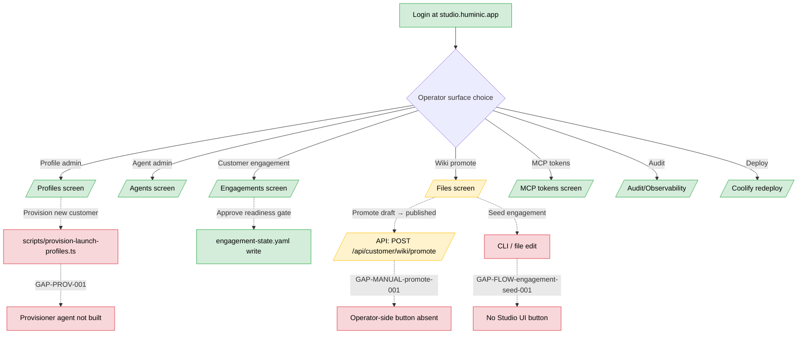

# Studio admin guide (Huminic Studio operator)

**Audience.** The single human running Huminic Studio with `is_admin: true` (today: Duane Wells). Everything in this manual assumes Studio admin login at `studio.huminic.app`.

**Scope.** Every operator-side surface: profiles, agents, engagements, wiki promotion, MCP tokens, audit, deployment, cross-actor patterns, and failure/recovery playbooks.

**How to use.** Each section names the button or screen, what it does on click, and what to verify after. When a button or screen doesn't exist today, the section says so explicitly + names the GAP-* row in `docs/launch/PLAN.md` running log + describes the launch-time workaround.

---

## Workflow shape



**Legend.** Green = works end-to-end today. Yellow = works but with a noted limitation. Red = gap in PLAN.md running log; this manual names the launch-time workaround.

---

## 1. Login

**Surface.** `https://studio.huminic.app/`

**Click path.** Land on `/` → if not authenticated, the login form renders inline. Enter username + password → POST `/api/auth` → response carries `{authenticated, profile, username, is_admin, is_customer_admin}` → redirect to `/` (or to `/p/<slug>` if the credential is customer-admin only).

**Launch credentials.** Studio admin: `duane / HuminicValidation2026!` on the `huminic` profile.

**Verification.** After login, sidebar nav renders with: Operations, Agents, Tasks, Engagements, Files, Skills, Plugins, MCP Tokens, Audit, Terminal, Memory.

**Sign-out.** No `/api/auth/logout` endpoint exists. To sign out: open the browser DevTools, application tab, clear all cookies for `studio.huminic.app`, refresh. Or use a fresh-incognito session per `feedback_live_headed_sweep.md` for QA passes.

> **Gap.** `GAP-LOGOUT-001` in `PLAN.md` — no logout endpoint or UI control. Small fix (~30 min) post-launch.

---

## 2. Profiles screen

**Surface.** `/profiles`

**What it shows.** Every profile under `~/.hermes/profiles/` on the production volume: slug, active state, agent count, last-touched. At launch: 15 profile dirs (10 customer-shaped + huminic-data-governor + serra-automotive-data-governor + strukture-data-governor + cedar-ridge-automotive-data-governor + consultative-agent).

**Switch active profile.** Click a profile row → "Set active". The active profile drives which set of agents, wiki, Brain, and MCP scopes the next chat session uses.

**Verification.** `/agents` and `/files` and `/memory` re-render with the newly-active profile's content.

---

## 3. Agents screen

**Surface.** `/agents` (Agent Library)

**What it shows.** Every custom agent defined in `~/.runtime/agent-definitions.json` plus every profile-distributed SOUL at `<active-profile>/SOUL.md` or `<active-profile>/governance/agents/*.md`.

**Create a custom agent.** Click "New agent" → form with name, description, model, systemPrompt. **Note:** today the only "instructions" field is `systemPrompt: string`. Pointing the agent at a wiki page is a discipline embedded in the prompt text, not a schema field.

> **Gap.** `GAP-AGENT-WIKI-001` — Studio custom agents lack first-class wiki-binding fields. Profile-distributed SOULs DO bind via frontmatter (`scope_contract:`, `workflow:`, `kanban_lane:`); custom agents don't. Backlog post-launch (~1 day to add `scope_contract_path`, `workflow_path`, `kanban_lane` to `AgentDefinition` + UI + inject at session start).

**Dispatch an agent.** Click an agent row → "New session". Opens a chat against that agent with its system prompt loaded.

---

## 4. Engagements screen

**Surface.** `/engagements` (overview) + `/engagements/<customer>` (detail)

**What overview shows.** Card per customer with a non-empty `engagement-state.yaml`. Each card has: current stage badge, 7-step progress bar (draft → gathering_data → solution_discovery → creation → submission → feedback → ready_to_run), tile counts (approved/pending/rejected gates), build-time crew + run-time crew sizes, open decisions count, deployment notes count, adjacent neighbors count, amber alert for next open deployment note.

**What detail shows.** Full drill-down: stage progress strip, stage history with skip markers, all 5 readiness gates with status badges + approver + topology decision, deployment notes (open highlighted, resolved dimmed), open decisions (options + blocking-stage + resolution), adjacent data neighbors with likelihood badge, build/run crew rosters side-by-side.

**Approve a readiness gate.** Open detail → click the gate's status badge → "Approve" → write approver name + notes → POST writes back to `<profile>/engagement-state.yaml`. The gate flips to `approved: true` + approval metadata captured.

**Seed a new engagement.** Today: no Studio UI button. Operator either edits `<customer>/engagement-state.yaml` by hand (via `/files` or via direct production-volume edit via Coolify shell) OR triggers via the consultative agent's initial dispatch (which seeds the file as a side effect of the `orient` phase).

> **Gap.** `GAP-FLOW-engagement-seed-001` — no Studio UI button to seed engagement-state.yaml at `draft`. Launch-time procedure: operator does this via the consulting human operator manual (see `consulting-human-operator-guide.md`). Post-launch: add a "New engagement" button on `/engagements` that runs the seed flow.

---

## 5. Files screen (wiki edit + promote)

**Surface.** `/files`

**What it shows.** Tree-view of the active profile's wiki and governance trees. Monaco-based editor on click.

**Edit a page.** Click a markdown file → editor opens → edit body + frontmatter → "Save". KSG runs against the proposed write (protected-tree, canonical-frozen, missing-frontmatter rules). On block: KSG verdict text displayed inline; the write is rejected.

**Promote a draft.** **No operator-side Promote button in `/files` today.** The promote flow exists as an API: `POST /api/customer/wiki/promote` with `{profile, from_path, to_path}`. The customer-storefront Knowledge tab consumes this; the operator-side `/files` screen does not expose a button.

> **Gap.** `GAP-MANUAL-promote-001` — operator-side promote button absent in Files screen. Launch-time procedure: operator uses one of three workarounds.

**Launch-time promote workarounds.**

1. **Customer-storefront path** (preferred). The operator can log in as `duane` on `/p/<slug>` (where huminic credentials carry both `is_admin: true` + `is_customer_admin: true`) and use the storefront Knowledge tab's Promote button, which already calls `/api/customer/wiki/promote`.
2. **Direct API call** via terminal: `curl -X POST https://studio.huminic.app/api/customer/wiki/promote -H "Cookie: hermes_session=<token>" -H "Content-Type: application/json" -d '{"profile":"<slug>","from_path":"knowledge/drafts/<page>.md","to_path":"knowledge/published/<page>.md"}'`.
3. **Direct git-mv on production volume**: `docker exec hermes-studio-... sh -c 'cd /root/.hermes/profiles/<slug> && git mv knowledge/drafts/<page>.md knowledge/published/<page>.md && git commit -m "promote <page>"'`. **This bypasses KSG.** Only use for break-glass. (The `hermes-studio-...` container mounts the `~/.hermes` volume at `/root/.hermes`; find its exact name with `docker ps | grep hermes-studio`.)

Post-launch fix: add a "Promote" affordance in the file editor for files under `knowledge/inbox/` or `knowledge/drafts/`. The endpoint already exists; this is a small UI change.

---

## 6. Skills / Plugins admin

**Surface.** `/skills` (skills catalog) + `/plugins` (loaded plugins) + `GET /api/plugins`

**What plugins screen shows.** The 3 loaded plugins from `~/.hermes/studio-plugins/`: `customer-console`, `messaging-hub`, `data-canvas`. Per-plugin: id, version, route count, slot count, bundle count, skill dependencies, MCP dependencies.

**What skills screen shows.** Skill scaffolds from `scaffold/skills/<id>/SKILL.md`. Per SRS-D2 disposition (DECISIONS.log 2026-06-01T07:55:00Z), 13 scaffolds exist but are NOT auto-registered as invokable in `/skills`. Operator-visible documentation only.

**Plugin manifest errors.** If a plugin's `plugin.yaml` is invalid (route collision, missing field, semver mismatch with Studio version), it surfaces in the `issues` array of `GET /api/plugins`. Read this when troubleshooting after a redeploy.

---

## 7. MCP tokens admin

**Surface.** `/mcp-tokens` (admin-only)

**What it shows.** The token registry consumed by the central-mcp config at `~/Claude-store/central-mcp/config/local.yaml`. Per-token: name, scope set, fingerprint, created-at, last-used-at, revoked-at (if revoked).

**Provision a new token.** Click "New token" → form with name + scope set (per `central-mcp` allowlist semantics — see `docs/system-services-resend.md`). On submit: token returned ONCE in the response, not persisted in plaintext. Operator copies the token into the consuming profile's `.env` (Coolify env vars or per-profile `.env` on the volume).

**Rotate a token.** Click an existing token row → "Rotate". Old token marked revoked, new token shown once. Operator must update consuming profile's `.env` and redeploy that profile's container.

**Verification after rotation.** `/audit` should show `MCP_AUTH_OK` for the new token + `MCP_AUTH_REVOKED` for the old.

---

## 8. Tasks / Kanban

**Surface.** `/tasks`

**What it shows.** The Hermes Kanban board scoped to the active profile. Lanes: `inbox`, `triage`, `in_progress`, `review`, `done`, plus per-profile custom lanes (e.g., `service-*` for storefront Service surfaces).

**Filter by lane prefix.** URL param `?lane_prefix=service-` filters to just service lanes. Customer-storefront Service tab consumes this.

**Move a task.** Drag across lanes OR click a task → "Move to" → choose lane. Writes back to `~/.hermes/kanban.db`.

---

## 9. Audit / observability

**Surface.** `/audit` + `/observability` + `/logs`

**What audit shows.** Append-only audit log. Filters: profile, agent, tool, success/failure, time range. Each row: timestamp, profile, actor (agent or user), action verb, target (e.g., MCP tool + args), outcome, latency, optional verdict text.

**KSG/DSG findings.** Filter `action_type IN ('KSG_BLOCKED', 'DSG_BLOCKED', 'KSG_RECONCILE', 'DSG_RECONCILE')` for governance findings.

**Reconciliation candidates.** Surface in `/engagements/<customer>` panel (deployment notes section), not in `/audit`. To approve: open the engagement detail → reconciliation candidate row → "Approve" or "Reject".

> **Gap.** `GAP-FLOW-stale-reconciliation-001` — no automatic stale-timeout policy on unapproved reconciliation candidates. Launch-time procedure: operator does a weekly sweep of every customer's `/engagements/<customer>` panel and resolves anything sitting beyond 7 days. Post-launch: add a `stale_after_days` policy + UI surface in `/engagements` overview.

---

## 10. Provisioning a new customer

**Today's procedure** (Provisioner agent not built — `GAP-PROV-001`):

1. **Decide the slug.** Lowercase, hyphens only, matches DNS-safe pattern. Verify the slug doesn't exist: `docker exec hermes-studio-... ls /root/.hermes/profiles/ | grep <slug>`. Should return nothing.
2. **Run the provisioning script** with all 7 slugs at once OR a single slug at a time. Reference: `scripts/provision-launch-profiles.ts`. The scripts ship inside the **studio** image at `/app/scripts` (GAP-VER-007 — requires a Coolify redeploy of the image built from the Dockerfile that copies `scripts/`). Run with `npx tsx` (the runtime image has `npx`+`tsx` in `node_modules`; it intentionally has no global `pnpm`). Single-slug invocation pattern:
   ```bash
   docker exec -it hermes-studio-... npx tsx scripts/provision-launch-profiles.ts --slug=<slug> --brand="<Brand Name>" --accent="#hexcolor" --customer-admin-username=<email> --customer-admin-password=<initial-password>
   ```
   This: creates `~/.hermes/profiles/<slug>/`, applies scaffold (distribution.yaml, SOUL.md, config.yaml, mcp.json, .env.example, skills/, cron/), writes `studio.yaml` with branding + 6-tab menu, writes `auth.yaml` with the customer-admin credential.
3. **Verify schema.** Crucial — P-FIX-003 caught a silent Zod fallback. After provisioning, check that `studio.yaml` uses `branding.persona_name` and NOT `brand.display_name`. Read the file: it should match the canonical huminic studio.yaml shape.
4. **Test login.** Open `/p/<slug>/` in a fresh-localStorage incognito session. Verify brand renders + login form accepts customer-admin credential.
5. **Provision data-governor sibling** (closes `GAP-SG-001` per-customer). Today: copy the huminic-data-governor SOUL template and customize the watch paths. Tomorrow: Provisioner agent does this in one shot.
6. **Record in DECISIONS.log** — `DEC` entry naming the new customer + provisioning timestamp.

**Post-launch.** Provisioner agent (SOUL stub authored in this Phase 8 pass; executor build is post-launch backlog) takes the consultative prescription manifest + runs all 6 steps idempotently.

---

## 11. Approving readiness gates

**When.** A consultative engagement reaches a phase boundary; the consultative agent proposes a gate approval; operator must approve before the engagement advances.

**The 5 gates.** Per `engagement-state.yaml` schema: `prescription_approved`, `topology_decided`, `data_storage_approved`, `mcp_access_approved`, `provisioning_ready`. (Schema is `topology_decided`, past tense — not `topology_decision`. The Phase 0 closeout vitest at `src/test/engagement-state-writer.test.ts` enforces this.)

**Click path.** `/engagements/<customer>` → scroll to readiness gates panel → click the gate's status badge (currently `pending`) → "Approve" → form: approver name + optional notes (note: `topology_decided` gate omits notes per schema) → submit → writes back to `engagement-state.yaml.readiness_gates[<gate_id>] = {approved: true, approver_name, approver_role, approved_at, notes}`.

**Verification.** Refresh `/engagements/<customer>` → gate badge flips green → audit row appears.

**Reject a gate.** Same flow with "Reject" instead. Writes `{approved: false, rejection_reason}`. Engagement stays in current stage.

---

## 12. Promoting drafts to published

See Section 5 (Files screen). Launch-time procedure: customer-storefront path OR direct API call OR break-glass git-mv. Post-launch: operator-side Promote button.

---

## 13. Rotating credentials + MCP tokens

**Customer-admin password rotation.** Run `scripts/create-user.ts` in the production **studio** container (the studio image ships `/app/scripts` after the GAP-VER-007 redeploy; it has `npx`+`tsx` but no global `pnpm`):
```bash
docker exec -it hermes-studio-... npx tsx scripts/create-user.ts --profile <slug> --username <email> --customer-admin
```
Prompts for new password (hidden input + confirm). Overwrites `~/.hermes/profiles/<slug>/auth.yaml`. Customer-admin's prior sessions are NOT invalidated by this rewrite — the in-memory session token registry would need a force-revoke. **GAP-FLOW-session-revoke-on-rotate-001** flagged: confirm whether password rotation also revokes existing sessions.

**MCP token rotation.** See Section 7.

**Studio admin rotation.** Same `create-user.ts` script with `--admin` instead of `--customer-admin`.

---

## 14. Deployment / Coolify redeploys

**Trigger a redeploy.** Two paths:

1. **GitHub merge to `main`.** Coolify watches the repo + auto-rebuilds on push. Standard CI.
2. **Manual redeploy via Coolify dashboard or API.** Use the central-mcp Coolify connector at `localhost:4002`:
   ```bash
   curl -X POST https://docker.huminicdev.com/api/v1/deploy -H "Authorization: Bearer $COOLIFY_TOKEN" -d '{"uuid":"nh5vnz9kz226cj9ib3nodg1j"}'
   ```

**Verify deployment.** After redeploy:
- `curl -s https://studio.huminic.app/api/auth-session | jq .` returns the auth-session shape (presence of `profile_auth_mode` field means new build).
- `curl -s https://studio.huminic.app/api/plugins -H "Cookie: ..." | jq '.plugins | length'` returns 3.
- Fresh-localStorage headed Playwright sweep on at least one storefront per `feedback_live_headed_sweep.md`.

**Rollback.** Coolify dashboard → previous deploy → "Redeploy this version". The hermes-state volume is unchanged on rollback (Docker volume is persistent), so customer wiki + auth.yaml + engagement-state.yaml survive across image rollbacks.

---

## 15. Cross-actor patterns the operator must own

These workflows span the operator's screens but require the operator to *coordinate* across the agents and customer-admins.

### Consultative → Prescription → Provisioning handoff (`WF-XAC-001`)

1. Consulting human operator runs consultative agent against a prospect.
2. Operator (in admin role) approves the 5 readiness gates as they come due.
3. Operator runs provisioning script (today; Provisioner agent tomorrow per `GAP-PROV-001`).
4. Operator sends customer-admin invite email (today: manual; tomorrow: provisioner emits via Resend MCP).
5. Customer-admin logs in at `/p/<slug>/` and verifies they can reach all 6 tabs.

**Recovery if step 3 fails partway.** Re-run the script with the same slug — `scripts/provision-launch-profiles.ts` is idempotent per Phase C.0 hardening. Check `/audit` to see what landed before failure.

### Draft → published promote with KSG (`WF-XAC-002`)

1. Customer-admin saves a draft via Knowledge tab.
2. KSG approves the draft (per Section 5).
3. Customer-admin requests promotion (Knowledge tab Promote button).
4. **Operator approves the promotion.** Today this is implicit — the customer-admin's promote call goes through `/api/customer/wiki/promote` which writes directly. There's no operator-in-the-loop approval step on the promote endpoint. **GAP-FLOW-operator-promote-approval-001** flagged: confirm whether operator approval should be required for `published/` writes; if so, add a queued-approval flow. If launch-time policy is "customer-admin owns their published wiki", document that explicitly in customer-admin-guide.md.
5. Audit row + canon page available immediately.

### KSG/DSG conflict → operator reconcile (`WF-XAC-005`)

1. Runtime agent or customer-admin attempts a write.
2. KSG or DSG detects a conflict (canon collision, contradicting Brain record).
3. Conflict surfaces in `/engagements/<customer>` deployment notes panel.
4. Operator opens the entry → reads context (the proposed write + the existing canon/record) → clicks "Approve resolution" (canon updates) OR "Reject" (write rejected, audit row).
5. All watchers re-read; runtime agents see the new state on next dispatch.

---

## 16. Failure & recovery operator playbook

### Channel adapter down (Vapi/TextMagic/Tavus/Resend 5xx)

**Detection.** `/audit` filter `action_type = COMMS_FAIL`. Or a customer-admin reports outbound not landing.

**Operator action.**
1. Check the central-mcp connector status: `curl -s http://localhost:4002/health`.
2. Check the per-profile `.env` for the channel credentials.
3. Check the provider dashboard (Vapi, TextMagic, Tavus, Resend) for outage.
4. If outage is external, mark messages in `agent_reply_jobs` with `status: failed_external` and inform customer-admin.
5. If credentials are wrong, rotate via Coolify env vars + redeploy.

> **Gap.** `GAP-FLOW-retry-policy-001` — per-adapter retry policy not consistently documented. Launch-time procedure: manual re-dispatch from `/audit`. Post-launch: add `retry_policy` to adapter scaffolds + dead-letter queue.

### Provisioning partial-fail

See Section 10. Re-run idempotent script; verify each step via `/profiles` and `/audit`.

### Engagement abandoned mid-design

**Today.** No `abandoned` stage in engagement-state.yaml schema (`GAP-ENG-STATE-ABANDON-001`). Operator can:
1. Leave the engagement frozen — it stays in whatever stage it's in.
2. Or manually edit `engagement-state.yaml` to add a `# ABANDONED 2026-MM-DD - reason` comment line.

**Post-launch.** Add `abandoned` as a terminal stage in the schema + UI surface.

### Coolify redeploy fails

Standard Coolify behavior: previous build remains live. Inspect Coolify logs. Common failures:
- Out-of-memory at build → bump build container size in Coolify.
- TypeScript compile error → check the PR that triggered the deploy + revert if needed.
- Tests fail in CI gate → fix tests or revert.

### Password reset token expired

Customer-admin redeems at `/reset` with expired token → page shows expired-token verdict + a re-request link → POST `/api/auth/reset-request` again.

### DSG reconciliation backlog growing

See Section 9 GAP-FLOW-stale-reconciliation-001. Weekly sweep of `/engagements/<customer>` panels.

---

## Cross-references

- Workflow ids covered: `WF-OP-001` through `WF-OP-007`, plus all `WF-XAC-*` and `WF-F&R-*`.
- Companion manuals: `consulting-human-operator-guide.md`, `customer-admin-guide.md`, `nexxus-migration-customer-guide.md`, `huminic-rollup-operator-guide.md`.
- Agent SOULs the operator dispatches: `consultative-agent/SOUL.md`, `huminic/governance/agents/provisioner.md` (SOUL stub only — agent not built), `<slug>-data-governor/SOUL.md`.

---

## Gaps surfaced during studio-admin-guide.md drafting

Newly flagged (to be added to PLAN.md):

- `GAP-FLOW-session-revoke-on-rotate-001` — confirm whether password rotation invalidates existing sessions. Section 13.
- `GAP-FLOW-operator-promote-approval-001` — confirm whether operator approval should be required on `/api/customer/wiki/promote` writes to `published/`. Section 15.

Existing gaps referenced in this manual (already in PLAN.md):

- `GAP-LOGOUT-001` (Section 1, 13)
- `GAP-AGENT-WIKI-001` (Section 3)
- `GAP-FLOW-engagement-seed-001` (Section 4)
- `GAP-MANUAL-promote-001` (Section 5)
- `GAP-FLOW-stale-reconciliation-001` (Section 9, 16)
- `GAP-PROV-001` (Section 10, 15)
- `GAP-SG-001` (Section 10)
- `GAP-ENG-STATE-ABANDON-001` (Section 16)
- `GAP-FLOW-retry-policy-001` (Section 16)

Total gaps in this manual: 2 new + 9 existing referenced. Logging the 2 new to PLAN.md next.
